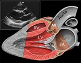
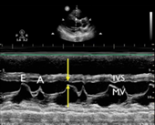

# Cardiology Main

---

# Atrial Fibrillation & Flutter

Brittany Saldivar

---

## Background

- AF: 12-lead EKG with absence of p-waves and irregularly irregular
    QRS complexes
- Flutter: sawtooth atrial F waves (300 BPM) with regular or regularly
    irregular QRS complexes
- Ventricular rate ratio of F waves: V waves \~150 (2:1), \~100 (3:1),
    or \~75 (4:1)
- 3 classifications
    - Paroxysmal (terminates within 7 days)
    - Persistent (persisting beyond 7 days)
    - Permanent (normal rhythm cannot be restored)
- Rapid ventricular response (RVR) is HR \> 100 (ie AF/Flutter w/
    tachycardia)
- AF/RVR is far more often a consequence of hypotension than the cause
    of it

## Evaluation

- Causes: Mnemonic “H PIRATES”
    - Hypertension
    - Pneumonia, Pericarditis, Post-op
    - Ischemia (rare)
    - Rheumatic Valve
    - Atrial Myxoma or Accessory Pathway
    - Thyrotoxicosis
    - Ethanol or Excess Volume
    - Sick sinus, Sepsis

## Management

- Treatment goals
    - Rate control, Goal HR \< 110 (RACE II)
    - Rhythm control (if indicated)
    - Stroke prevention

Rate control (inpatient)

- RVR \~ sinus tach of AF; Always work to address the underlying cause
    (infection, volume overload, etc). Rate control is rarely an
    emergency unless the patient is unstable
- If stable with RVR (SBP \>90)
    - IV if HR \> 130 or symptomatic (metop 5 mg IV or dilt 15-20 mg
        IV), otherwise do PO
    - AV nodal blocking agents
        - B-blockers: Start with metop tartrate (titratable)
          consolidate to succinate. Avoid in decompensated or
          borderline HF
        - Calcium channel blockers (diltiazem): avoid in HFrEF
- Peri stable (SBPs 80s-90 with preserved perfusion)
    - Amiodarone: Consider if decompensated HF, accessory pathway,
        anti-coagulated. Caution that you may cardiovert pt (stroke
        risk)
- Unstable (SBPs \<80)
    - Cardioversion

Rate control (outpatient)

- typically achieved with beta blocker therapy,
  metoprolol is most frequently used

Rhythm control (inpatient)

- New onset a-fib (first time diagnosis): most pts will be a candidate
    for trial of cardioversion
- If onset clearly within 48 hours, can proceed without TEE. Often TEE
    is done anyway (pt may have had intermittent asymp AF)
- If onset \>48 hours or unclear, will need TEE to rule out LAA
    thrombus
- Pharmacologic options include class 1C: flecainide, propafenone
    (avoid in structural heart disease) and class 3: Amiodarone,
    dronedarone, sotalol, ibutilide, dofetilide (some require loading
    inpt)
      - Caution using antiarrhythmics in any pt you wouldn't
        electrically cardiovert without TEE

Rhythm control (outpatient)

- Consider EP consult for ablation in symptomatic paroxysmal or
    persistent AF refractory to anti-arrhythmic drugs, AF in HFrEF, or
    flutter
- Stroke Prevention (for AF and flutter)
    - CHA2DS2-VASc risk score \>2 in M or \>3 in F should prompt long term
    AC in AF persisting \>48 hours
    - NOACs (apixaban, dabigatran, edoxaban, rivaroxaban) are preferred to
    warfarin except in moderate to severe MS or mechanical valve
- If cardioversion planned for new onset AF, start AC as soon as
    possible
      - Post-cardioversion, anticoagulate for at least 4 weeks due to
        atrial stunning and stroke risk
- If no contraindications or procedures, continue anticoagulation
    while inpatient
- Typically do not need to bridge AC for AF in the setting of
    procedures unless mechanical valve is present. Decide on a case
    by-case basis
- Left atrial appendage closure can be considered in those with
    increased risk of bleeding

# Valvular Heart Disease

---

# Aortic stenosis

Jonathan Napper 

---

## Etiology

- Degenerative calcification of the aortic cusps
- Congenital bicuspid aortic valve
- Chronic deterioration (calcific)
- Prior rheumatic fever/inflammation

## Presentation

- Angina, syncope, exertional dyspnea, heart failure (HF carries worse
    prognosis)
- Typically aged 70 – 80 y/o; if bicuspid aortic valve expect 10-20
    yrs earlier
- Physical exam: Systolic crescendo-decrescendo murmur that radiates
    towards the carotids
- Late peaking murmur, faint or absent S2, or delayed carotid upstroke
    suggest severe AS

## Evaluation

- TTE with doppler is test of choice

<table>
<colgroup>
<col style="width: 20%" />
<col style="width: 19%" />
<col style="width: 20%" />
<col style="width: 20%" />
<col style="width: 20%" />
</colgroup>
<thead>
<tr class="header">
<th>Severity  </th>
<th>Valve Area (cm2) </th>
<th>Mean Gradient (mmHg) </th>
<th>
Velocity  

(m/s) 
</th>
<th>Indexed Valve Area (cm2/m2)  </th>
</tr>
</thead>
<tbody>
<tr class="odd">
<td>Mild  </td>
<td>&gt;1.5 </td>
<td>&lt;20 </td>
<td>2.0-2.9 </td>
<td>&gt;0.85 </td>
</tr>
<tr class="even">
<td>Moderate  </td>
<td>1.0-1.5 </td>
<td>20-39 </td>
<td>3.0-3.9 </td>
<td>0.60-0.85 </td>
</tr>
<tr class="odd">
<td>Severe </td>
<td>&lt;1.0 </td>
<td>&gt;40 </td>
<td>&gt;4.0 </td>
<td>&lt;0.6 </td>
</tr>
<tr class="even">
<td>Critical  </td>
<td>&lt;0.5 </td>
<td>-- </td>
<td>-- </td>
<td>-- </td>
</tr>
</tbody>
</table>

AS stages

- A: at risk of AS (those with bicuspid anatomy or calcification
- B: Asymptomatic non-severe AS
- C: asymptomatic AS
    - C1: normal EF
    - C2: abnormal EF
        - This stage might benefit from exercise or stress testing to
          elicit symptoms
- D: Symptomatic AS

- Some with symptomatic AS might not have enough LV reserve to produce
    high velocities and gradients (ex EF of 10% w/ critical valve area)
    = low flow/low gradient AS; consider dobutamine to unmask AS

## Management

- No proven effective medical therapy
- Definitive treatment is valve replacement for:
    - Stage D
    - Stage C with inducible symptoms on stress testing, low EF, or
        undergoing other cardiac procedure
    - Rapid progression (increase in velocity \>0.3m/sec per year)
- Consult cardiac surgery for determination of SAVR vs TAVR
    - In general, high risk surgical patients benefit most from TAVR
    - At VUMC: If determined to be intermediate to high operative risk by
        Cardiac Surgery, they will often recommend contacting the TAVR team
        for evaluation
- Avoid rapid hemodynamic shifts and aggressive changes in preload or
    afterload
- Aim for normotension
    - Avoid preferential vasodilators such as
    hydralazine or nitroglycerin
    - Significant vasodilation may ↓ coronary filling pressures -\>
    myocardial ischemia

## Monitoring

- Severe AS: TTE q 6-12 months
- Moderate AS: TTE q 1-2 years
- Mild AS: TTE q 3-5 years

## Post AVR anticoagulation

- All patients will get 3-6 months of AC s/p AVR
- Continued duration based on type of AVR
    - Bioprosthetic (TAVR and some SAVRs): antiplatelets alone after
        Initial AC
    - Mechanical: lifelong AC with warfarin only

# Aortic Regurgitation

Jonathan Napper 

---

## Etiology

- Primary valve disease (rheumatic disease, bicuspid aortic valve,
    infective endocarditis, syphilis)
- Primary aortic root disease (medial degeneration, aortic dissection,
    Marfan’s syndrome, bicuspid aortic valve, syphilis, non-syndromic
    familial)

## Presentation

- Acute AR: LV cannot respond to increased volume to maintain stroke
    volume pulmonary edema and cardiogenic shock
- Chronic AR: indolent presentation, often patient will develop
    symptoms of heart failure including DoE, orthopnea, PND
- Physical exam: “Water-hammer” pulses, wide pulse pressure, laterally
    displaced PMI, high pitched “blowing” decrescendo murmur best heard
    at third intercostal space at left sternal border, S3

## Management

- Acute severe AR
    - Prompt surgical repair
    - Vasodilators such as nitroprusside and diuretics can be used to
        stabilize patient
- Chronic severe AR
    - Medical management
    - Early symptoms of exercise intolerance can be treated with
        diuretics
    - Systolic BP should also be controlled with goal SBP \< 140 in
        chronic AR

- Repeat imaging should be performed 3-6 month to assess for depressed
    LVEF or LV dilation

- Stages of Chronic AR: Ranging from Stage (A): Asymptomatic but “At
    Risk” AR to Stage (D) Symptomatic Severe AR
      - If symptoms are present, automatically Stage D, otherwise
        Progression through stages is determined by AR Jet Width
- Class I indications for Valve Repair:
    - Stage D (Symptomatic) or Stage C (Asymptomatic Severe AR)
      with LVEF \< 55%, or are undergoing other
      cardiac surgery
    - If LVEF \> or equal 55%, patients should be considered for
            surgery if LV is dilated (LVESD \> 50 mm (class IIa) or LVEDD \>
            65 mm (class IIb))
    - Any patient with progressive AR, even if they do not meet criteria
        for severe AR, should consider valve replacement if undergoing
        cardiac surgery for other reasons
    - Note: TAVI for isolated chronic AR is challenging 2/2 dilation
            of the aortic annulus and root

# Mitral Regurgitation

Marcus Threadcraft

---

## Etiology

- Primary MR – caused by direct involvement of the valve apparatus
    (leaflets or chordae tendineae)
- Degenerative/myxomatous mitral valve disease (mitral valve prolapse
    with flail leaflet, mitral annular calcification, chordal rupture)
- Rheumatic fever
- Infective endocarditis
- Papillary muscle rupture following acute (inferior) MI
- Secondary MR- caused by changes of the LV that lead to valvular
    incompetence
- Dilated Cardiomyopathy
- HOCM with systolic anterior motion
- Coronary Artery Disease or prior MI leading to papillary muscle
    tethering

## Presentation

- Acute MR- sudden onset reduction in forward cardiac flow and left
    atrial/pulmonary vein volume overload
- Dyspnea with flash pulmonary edema
- Left-sided heart failure
- Chronic MR- progressive symptoms d/t cardiac remodeling to
    compensate for mitral flow reversal
- Progressively worsening heart failure: dyspnea, orthopnea, PND
- LV dilation from volume overload
- LA remodeling/dilation leading to afib

## Auscultation

- Holosystolic Murmur
- Best heard at Apex
- Radiation to the Axilla
- Frequently associated with S3
- Murmur may be absent in acute MR due to large regurgitant
    orifice/low velocity regurgitant jet
- Increases w/ increased preload or afterload
- Pulmonary Rales

## Evaluation

- CXR: assess for pulmonary edema, r/o other causes of acute dyspnea
- ECG: often non-specific, LVH
- Echocardiography: assess valve apparatus, size, and function of
    LA/LV, grade severity of MR

## Chronic MR stages

- A: No symptoms
- B: \>mild MR w/o hemodynamic changes or symptoms
- C: Severe MR w/o symptoms
    - C1: preserved EF and normal LV size
    - C2: reduced EF (\<60%), dilated LV (LVESD \> 40mm)
- D: Severe/symptomatic

## Management

Acute hemodynamically significant MR

- Urgent surgical repair or replacement
- Medical stabilization as a bridge to surgery
    - Afterload reduction is key to promote forward flow
    - Vasodilators (nitroprusside, nitroglycerin) reduce afterload
    - Diuresis to reduce preload and improve pulmonary edema
    - IABP placement can be used as mechanical afterload reduction

Chronic severe primary MR

- Surgical repair favored over valve replacement
- Class I:
    - Asymptomatic patients w/ LVEF 30-59% or LVESD \> or equal 40mm
    - Symptomatic patients w/ EF \> 30%
- Class II:
    - A: asymptomatic patients with progressive EF decline or LV
        dilation on serial monitoring; or very severe MR
    - B: new onset AF
- Secondary MR can consider MV repair with persistent class III-IV
    symptoms while on guideline directed medical therapy
- In HFrEF, consider MitraClip after volume optimization (see Heart
    Failure section)

# Mitral Stenosis

Marcus Threadcraft

---

# Etiology

Characterized by thickened mitral valve leaflets and fused
leaflet tips.

- Rheumatic Fever (leading cause worldwide)
- Calcification of the mitral valve annulus (common in high income
    countries)
- Autoimmune Diseases: SLE, Rheumatoid arthritis

## Presentation

- Progressive symptoms: Asymptomatic Heart Failure
- Orthopnea
- PND
- Hoarseness/Dysphagia (compression of recurrent laryngeal
    nerve/esophagus by enlarged left atrium from pressure overload)
- Symptoms of Right Heart Failure
- Acute Symptoms may present in settings of increased cardiac output
    (pregnancy, sepsis, or exercise) or tachyarrhythmias
- Dyspnea
- Fatigue
- Palpitations

## Physical exam

- Low-pitched rumbling, diastolic Murmur, best heard at apex,
    low-pitched, rum
    - Loud S1, opening snap after S2
    - Prominent P2 if pulmonary HTN develops
- Pulmonary Rales

## Evaluation

- CXR: LA enlargement, increased pulmonary vasculature
- Echocardiography: thickening of mitral valve leaflets, decreased
    area of valve leaflets, left atrial enlargement

## Management

- Varies between rheumatic MS and calcific MS (in general,
    intervention of calcific MS is very challenging and high risk)
- Severe, symptomatic rheumatic MS:
    - Percutaneous mitral balloon commissurotomy (PMBC)
    - Surgical repair/replacement if patient failed PMBC or undergoing
    other cardiac surgery
- Calcific MS has a poor prognosis with 5-year survival \<50%,
    Intervention is higher risk and should be reserved for severely
    symptomatic patients

- No role for commissurotomy with calcific MS
- Surgical valve replacement may be considered for severely
    symptomatic patients (technically challenging)

## Anti-Coagulation

- Anti-coagulation is indicated if:
    - Mechanical prosthetic mitral valve
        - Warfarin, goal INR 3-4 lifelong
    - Bioprosthetic mitral valve replacement
        - Warfarin, goal INR 2-3 for first 3-6 months
    - Atrial Fibrillation regardless of CHADS2VASC score

# Heart Failure

Brittany Saldivar

---

## Background

ACC/AHA Stages of HF

- Stage A: At risk but without structural heart disease or symptoms
- Stage B: + structural HD, - symptoms
- Stage C: + structural HD, + prior or current symptoms
- Stage D: refractory HF requiring specialized intervention

NY Heart Association (NYHA) Functional Classes of HF

- Class I: Normal physical activity is not limited
- Class II: Comfortable at rest; normal physical activity results in
    HF symptoms
- Class III: Comfortable at rest; less than normal activity leads to
    HF symptoms
- Class IV: Inability to perform any physical activity without
    symptoms

## Etiologies

- HFrEF (Clinical diagnosis + LVEF \< 40%)
    - Ischemic: Obstructive CAD, previous/current myocardial
        infarction
    - Non-ischemic:
        - Load: HTN, valvulopathy
        - Arrhythmia: tachyarrhythmia, pacemaker induced
        - Myocardium
    - Toxins (EtOH, drugs, chemo, radiation),
    - Inflammatory (infections, AI),
    - Metabolic (thyroid, thiamine deficiency),
    - Infiltrative (amyloid, sarcoid, hemochromatosis)
    - Stress induced/takotsubo CM
        - Genetic
        - Idiopathic
- HFpEF: HTN, CAD, obesity, DM, infiltrative, hypertrophic
    cardiomyopathy

Causes of Heart Failure Exacerbations (FAILURES)

- Forgetting medications or taking drugs that can worsen HF (e.g. BB,
    CCB, NSAIDs, TZDs), chemo (anthracyclines, trastuzumab)
- Arrhythmia/Anemia: AF, VT, PVCs; Increased arrhythmia burden on
    device check?
- Ischemia/Infarction/Infection: myocarditis; Acute vascular
    dysfunction (e.g. endocarditis), especially mitral or aortic
    regurgitation.
- Lifestyle choices: Dietary indiscretions - high salt, EtOH,
    excessive fluid intake. Obesity.
- Upregulation (of CO): pregnancy and hyperthyroidism
- Renal failure: acute, progression of CKD, or insufficient dialysis
    (Increased preload)
- Embolus (pulmonary) or COPD (leads to increase right-sided
    afterload)
- Stenosis (worsening AS, RAS) leading to hypertensive crisis high
    left-sided afterload

## Presentation

- Volume overload: shortness of breath, dyspnea on exertion,
    Orthopnea, PND
- Nausea/poor po intake (hepatic and gut congestion)
- Confusion (decreased CO)
- Exam: Edema (legs, sacrum), rales, S3, S4, murmur (AS, MR), elevated
    JVD, + hepatojugular reflex, ascites

## Evaluation

- CBC, CMP, Magnesium, Lactate, TSH, iron studies
- Troponin, ECG
- BNP (Pro-BNP if on Entresto) – high negative predictive value for HF
    (false negative can occur in obese patients)
- CXR – differentiate other causes of dyspnea
- TTE
- Determine hemodynamic and volume profile
    - Cold vs warm
    - Dry vs wet

<table>
<colgroup>
<col style="width: 19%" />
<col style="width: 23%" />
<col style="width: 25%" />
<col style="width: 31%" />
</colgroup>
<thead>
<tr class="header">
<th>Cardiac Index</th>
<th></th>
<th>Euvolemia</th>
<th>Hypervolemia</th>
</tr>
</thead>
<tbody>
<tr class="odd">
<td>Low</td>
<td>
Warm Extremities

Adequate UOP

Normal PPP
</td>
<td>
Warm and Dry

Forrester Class I

Tx: GDMT as tolerated
</td>
<td>
Warm and Wet

Forrester Class II

Tx: Diuresis, Vasodilators
</td>
</tr>
<tr class="even">
<td>Normal</td>
<td>
Cardiogenic Shock

Cool Extremities

Renal Failure

Narrow PP
</td>
<td>
Cold and Dry

Forrester Class III

Tx: Inotropes
</td>
<td>
Cold and Wet

Forrester Class IV

Tx: Diuresis +Tailored therapy (+/- vasodilators, inotropes)
</td>
</tr>
</tbody>
</table>

## Management

- Telemetry, Daily STANDING weights, 2 L fluid restriction, 2g sodium
    diet, strict I/Os
- Diuresis: Place on 2.5 x home dose of IV diuretic, dose BID-TID
    (DOSE Trial)
- Goal is to be net negative (generally 1-2 L per day but patient
    dependent)
- Check BMP BID and Mg QD, keep K\>4 and Mg\>2
- Low threshold for substantial increase (double) in loop vs
    transition to drip if not diuresing adequately
- Can also augment with sequential nephron blockade (thiazides,
    acetazolamide)
- Continuation/optimization of GDMT (below)

# Guideline-Directed Medical Therapy for HFrEF

Brittany Saldivar

---

## General Principles

- Starting patients on low dose of multiple agents preferred to max
    dose of single agent
- D/C summary should have discharge weight, diuretic regimen, and
    renal function
- Daily weights at home with rescue diuretic plan (pm dose for 3 lbs
    in 1 day, 5 lbs in 3 days

<table>
<colgroup>
<col style="width: 22%" />
<col style="width: 26%" />
<col style="width: 26%" />
<col style="width: 25%" />
</colgroup>
<thead>
<tr class="header">
<th>Drug</th>
<th>Indication</th>
<th>Mechanism/ Benefits</th>
<th>Precautions</th>
</tr>
</thead>
<tbody>
<tr class="odd">
<td colspan="4">Beta Blockers</td>
</tr>
<tr class="even">
<td>
Carvedilol

Metoprolol succinate

Bisoprolol
</td>
<td>
HFrEF &lt;40 %

Stage C HF (NYHA class I – IV)
</td>
<td>Reduces catecholamine stimulation. Decreased HR, myocardial energy
demand, less adverse remodeling.</td>
<td>
Avoid if pt is decompensated (cold); “start low and go slow”

Can continue during exacerbation if patient compensated
</td>
</tr>
<tr class="odd">
<td colspan="4">ARNIs</td>
</tr>
<tr class="even">
<td>Sacubitril/ valsartan</td>
<td>
HFrEF &lt; 40%

NYHA class II – IV

Used in place of ACE/ARB
</td>
<td>Prevents vasoactive natriuretic peptide degradation involved in
pathogenesis of HF (+ action of ARB)</td>
<td>
Need a 36 hr wash-out period if transitioning from ACEi to
ARNI

Hypotension

Risk of angioedema
</td>
</tr>
<tr class="odd">
<td colspan="4">ACEIs</td>
</tr>
<tr class="even">
<td>
Lisinopril

Enalapril

Captopril

Ramipril
</td>
<td>
HFrEF &lt;40 %

Stage C HF (NYHA class I – IV)
</td>
<td>Blocks harmful effects of RAAS activation and attenuates adverse
cardiac and vascular remodeling</td>
<td>
Risk of angioedema

Monitor renal function and K
</td>
</tr>
<tr class="odd">
<td colspan="4">ARBs</td>
</tr>
<tr class="even">
<td>
Losartan

Valsartan

Candesartan
</td>
<td>
HFrEF &lt;40 %

Stage C HF (NYHA class I – IV)
</td>
<td>See ACEIs</td>
<td>
See ACEIs

Preference for ARB &gt; ACEi if plans to start ARNI
</td>
</tr>
<tr class="odd">
<td colspan="4">MRAs</td>
</tr>
<tr class="even">
<td>
Eplerenone

Spironolactone
</td>
<td>
NYHA class II-IV and

GFR &gt;30
</td>
<td>Diuretic and blood pressure lowering effects and blocks deleterious
effects of aldosterone on the heart (including hypertrophy and
fibrosis)</td>
<td>Hyperkalemia – avoid if CrCl &lt;30 or K &gt;5</td>
</tr>
<tr class="odd">
<td colspan="4">SGLT2i</td>
</tr>
<tr class="even">
<td>
Dapagliflozin

Empagliflozin
</td>
<td>
HFrEF &lt;40% with and without DM

NYHA class II-IV

In conjunction with background GDMT
</td>
<td>Osmotic diuresis and natriuresis, improve myocardial metabolism,
inhibit sodium-hydrogen exchange in myocardium, reduce cardiac
fibrosis</td>
<td>
UTI/ GU infections

Risk of ketoacidosis (both DKA and euglycemic)
</td>
</tr>
<tr class="odd">
<td colspan="4">Vasodilators</td>
</tr>
<tr class="even">
<td>
Hydralazine

Isosorbide Dinitrate
</td>
<td>
Persistently symptomatic black patients despite ARNI/ BB/ MRA/
SGLT2i

NYHA class III-IV
</td>
<td>
Reduces cardiac afterload and preload and may also enhance nitric
oxide bioavailability

Reduction in mortality for African American patients
</td>
<td>Hypotension</td>
</tr>
<tr class="odd">
<td colspan="4">Ivabradine</td>
</tr>
<tr class="even">
<td>Ivabradine</td>
<td>
HFrEF &lt;35%, on maximally tolerated BB, sinus rhythm with HR
&gt; 70

NYHA class II or III
</td>
<td>
If current inhibitor involved in SA node activity

Decr HR associated with improved outcomes
</td>
<td>
Need sinus rhythm

Caution in sinus node disease and conduction defects
</td>
</tr>
<tr class="odd">
<td colspan="4">Iron Repletion (IV)</td>
</tr>
<tr class="even">
<td>
Iron sucrose

Ferric carboxymaltose

Iron dextran
</td>
<td>Ferritin &lt;100 µg/L or ferritin 100-299 µg/L AND transferrin
saturation &lt;20%</td>
<td>
Decreases HF hospitalizations

Improves exercise function and QOL
</td>
<td>Risk of anaphylaxis higher in iron dextran</td>
</tr>
</tbody>
</table>

## Device therapies (after optimization of medical GDMT)

- Cardiac resynchronization therapy (CRT)
    - Class I indication: NYHA class II to IV, LVEF ≤35% with QRS ≥150 ms
    and left bundle branch block (LBBB)
    - Class II (consider) If EF \< 35% and:
        - QRSd \> 150, without LBBB
        - AF that requires ventricular pacing and AVN ablation
        - Undergoing placement of device with anticipation of \>40%
        ventricular pacing
- ICD
    - Class I indication: NYHA class II – VI with LVEF \<35% (must have
    \>1yr expected survival and 40+ days from MI)
- Mitra Clip
    - Criteria: moderate to severe mitral regurgitation (3-4+), on
    maximally tolerated GDMT, an ejection fraction \>20%, and a left
    ventricle end-systolic dimension of less than 7 cm

# Cardiogenic Shock

Ashley Cozart

---

## Definition

Impairment of cardiac output due to primary cardiac disorder that
    results in end-organ hypoperfusion and hypoxia

## Etiology

- Cardiomyopathic: myocardial infarction with LV dysfunction,
    exacerbation of heart failure, myocarditis, myocardial contusion,
    drug-induced
- Arrhythmic: atrial tachycardias (atrial fibrillation/flutter, AVRT,
    AVNRT), ventricular tachycardia and fibrillation, complete heart
    block, second degree heart block
- Mechanical: valvular insufficiency, valvular rupture, critical
    valvular stenosis, ventricular septal wall defect, ruptures
    ventricular wall aneurysm, atrial myxoma

## Presentation

- Cold (decreased perfusion) due to reduced cardiac output (can be
    wet- increased PCWP OR dry normal PCWP)
- Symptoms of volume overload + end-organ hypoperfusion (altered
    mental status, nausea, abdominal pain, decreased urine output)
- Hypotension; narrow pulse pressure

## Evaluation

- EKG
- Labs: CBC, CMP, BNP, troponin, lactate
- Evidence of end organ damage: lactic acidosis, acute kidney injury,
    acute liver injury
- Echocardiogram: assess EF and valves
- LHC If ischemia (see ACS)
- Hemodynamic monitoring via Swan-Ganz or PA catheter:
    - No benefit for general shock but does improve in-hospital mortality
    for those with cardiogenic shock
    - PA catheter hemodynamic profile:
        - Cardiac index \< 2.2, cardiac power \<0.6, SVR 800-1600, SVO2
        \<60%
        - LV-dominant: RA (CVP) \<15, PCWP \>18, PAPi \>1.5 (pulmonary
        artery pulsatility index)
        - RV-dominant: RA \>15, PCWP \<18, PAPi \>1.5
        - Bi-V-dominant: RA \>15, PCWP \>18, PAPi \>1.5
        - PAPi \< 1 indicates that patient will likely need RV support
        - CP \< 0.5 strongest independent hemodynamic correlate of
        mortality in CS
        - See right heart cath section for interpreting PA catheter
        profiles

## Management (medical & mechanical circulatory support)

### Medical management

Focus on optimizing preload, afterload, and contractility.

- Preload: IV diuresis
- Afterload: IV – nitroglycerine, nitroprusside; PO – hydralazine,
    isosorbide dinitrate; vasoconstricting pressors (phenylephrine,
    vasopressin) if needing BP support
- Contractility - Inodilators (increase contractility, decrease
    afterload – milrinone, dobutamine) or inoconstrictors (increase
    contractility and afterload – epinephrine, norepinephrine)

### Mechanical circulatory support indications

- Shock refractory to \>1 pressor
- Shock 2/2 MI (physiology: unloads LV, increases systemic perfusion,
    increases myocardial perfusion, and provides hemodynamic support
    during PCI)

Types of mechanical circulatory support (MCS)

<table>
<colgroup>
<col style="width: 6%" />
<col style="width: 25%" />
<col style="width: 22%" />
<col style="width: 22%" />
<col style="width: 23%" />
</colgroup>
<thead>
<tr class="header">
<th></th>
<th>Intra-aortic Balloon Pump</th>
<th>V-A ECMO</th>
<th>Tandem Heart</th>
<th>Impella</th>
</tr>
</thead>
<tbody>
<tr class="odd">
<td>Dynamics</td>
<td>Inflates during diastole, deflates during systole</td>
<td>Blood from femoral vein is oxygenated and pumped to femoral
artery</td>
<td>
LV: blood aspirated from LA to femoral artery

RV: blood aspirate from RA to PA
</td>
<td>
Impella 2.5, 5.0 &amp; CP: Blood aspirated from LV to aortic
root

Impella RP: Blood aspirated from IVC and delivered to PA
</td>
</tr>
<tr class="even">
<td>Flow</td>
<td>1 LMP</td>
<td>4.5 LPM</td>
<td>4-5 LPM</td>
<td>
2.5: 2.5 L/min

CP: 3.33 L/min

5.0: 5 L/min

RP: 4 L/min
</td>
</tr>
<tr class="odd">
<td>Support</td>
<td>LV</td>
<td>BiV</td>
<td>LV, RV, or BiV</td>
<td>LV or RV (RP)</td>
</tr>
<tr class="even">
<td>Effects</td>
<td>
Reduces afterload

Increases stroke volume (SV)

Increases coronary perfusion

Reduces LV preload and PCWP
</td>
<td>
Increases afterload

Reduces SV

Reduces LV preload and PCWP

Improves tissue perfusion
</td>
<td>
Increases afterload

Reduces SV

Reduces LV preload and PCWP

Improves tissue perfusion
</td>
<td>
Reduces SV

Reduces preload and PCWP

Improves tissue perfusion
</td>
</tr>
<tr class="odd">
<td>Complications</td>
<td>
Thrombocytopenia

Thrombosis

Arterial obstruction

Aortic rupture or dissection

Air embolism
</td>
<td>
Circuit thrombosis

LV dilation

Hypothermia

Gas embolism
</td>
<td>
Tamponade d/t perforation

Thrombosis

Embolism (gas or thrombus)

Arterial Shunt
</td>
<td>
Pump migration

Hemolysis

Aortic regurg

LV perf

VT/VF
</td>
</tr>
</tbody>
</table>

Daily management of MCS devices:

- Ensure optimal placement of device with daily CXR
- Anticoagulation (based on device)
- Hematoma monitoring at device site
- Check distal pulses to monitor for limb ischemia

Pearls for MCS

- MCS devices are contraindicated in following situations: aortic
    regurgitation or metallic aortic valve, aortic aneurysm or
    dissection, severe aortic or peripheral artery disease, left
    ventricular or left atrial thrombi, bleeding diathesis, uncontrolled
    sepsis
- ECMO is placed by the cardiac surgery team, once a patient is
    cannulated they will move onto the cardiac surgery team
- Impella, tandem heart, and IABPs are placed in the cath lab
- MCS is a bridge to recovery/definitive therapy, durable cardiac
    support (VAD), or transplant

# Cardiac Devices

Marcus Threadcraft

---

## Types of Cardiac Implantable Electronic Devices (CIED)

- For Controlling Arrhythmias: Implantable Pulse Generators
- Pacemakers: Anti-bradycardia pacing
- ICDs: Anti-tachycardia pacing and defibrillation
- Biventricular Pacemakers: CRT for ventricular dyssynchrony (LBBB &
    Heart Failure)
- Loop Recorders: implantable devices for monitoring arrhythmias (most
    often Afib)
- LVADs: augment cardiac output for end-stage heart failure (not
    covered here)

### Pacemakers

- Provide anti-bradycardia pacing by stimulating myocardium
- Peripheral permanent pacemakers (PPMs)
- SubQ generator, transvenous leads
    - Single chamber RV lead
    - Dual chamber RV and RA leads
    - BiV: RV, RA, and LV (coronary sinus) leads
- Leadless pacemaker
    - Implanted generator in RV

Indications

- Symptomatic Bradycardia
- Heart Block: 2nd Degree Type II w/ sx or 3rd Degree
- Sick Sinus Syndrome
- Carotid Sinus Syndrome
- After catheter ablation of AV node for AF
- CRT

### Implantable Cardioverter/Defibrillators (ICDs)

- Pacing lead + defibrillation coil
- Detect and treat VT/VF v
    - Anti-tachycardia pacing (ATP)- attempts to entrain and terminate
        VT
    - Defibrillation If ATP unsuccessful

Indications

- Primary prevention
    - HFrEF
        - EF \<35% and NYHA II-III or EF \<30% and NYHA I
        - Must be \>90d from revasc, \>40d from MI, and on GDMT
    - Arrhythmogenic syndromes
        - Arrhythmogenic RV cardiomyopathy, Brugada syndrome, HCM and
            cardiac sarcoid with specific risk factors
- Secondary prevention
    - Hx VF arrest or VT
    - Inducible VT on EP study with history of syncope

### Cardiac Resynchronization Therapy (CRT)

- BiV pacer that coordinates LV/RV contraction through synchronized
    activation of each ventricle following atrial contraction.
- -P: CRT pacing only
- -D: ICD function

Indications

- Class I: LBBB and QRS≥150 with EF\<35%, NYHA II- IV, on GDMT, NSR
- Class IIa: EF\<35%, NYHA II- IV, on GDMT, NSR AND
    - LBBB & QRS 120-149, non-LBBB & QRS≥150, or EF\<35% and expected
        to require \>40% ventricular pacing

### Interpreting Pacemaker Codes

|                                                                              | 1st Letter    | 2nd Letter     | 3rd Letter              | 4th Letter       |
|------------------------------------------------------------------------------|---------------|----------------|-------------------------|------------------|
| A: atrial, V: ventricular, D: dual, O: none, I: inhibition, R: rate-adaptive | Chamber Paced | Chamber Sensed | Response to Sensed Beat | Program Features |

### Examples of Common Pacing Modes

- VVI: Single RV lead that delivers a beat if no beat sensed. Often
    used with chronic AF with bradycardia
- DDDR: Senses and paces both the atria and ventricle. If beat not
    sensed within a predefined interval, beat delivered. R indicates
    rate responsivity (changes rate based on changes in patient
    activity)
- Magnet: Paces at a fixed rate without respect to native electrical
    activity (AOO,VOO,DOO). Deactivates ICD shock. Often used in surgery
    or at end of life to avoid ICD shocks

### Additional Configurations

- Epicardial Leads- pacemaker/defibrillator leads attached to outside
    of the heart (requires OR) vs traditional transvenous lead
    placement, which are inserted in the Cath Lab
    - Epicardial Leads generally placed in smaller children or during
        cardiac surgery with expected need for pacing/defibrillation
- Abandoned leads
    - Absolute contraindication to MRI (ungrounded, produces heat and
        thermal Injury In setting of magnetic field)

### Placement Complications

- Acute: pocket hematoma, pneumothorax, myocardial perforation,
    cardiac tamponade, infection, lead displacement or disconnection
- Long-term: secondary device infection, lead fracture (lead lifetime
    10-15 years), insulation failure

# Pulmonary Embolism

Anna Berry

---

## Background

A thrombus originating in a deep vein (LE \> UE) embolizing to the
    pulmonary arterial circulation.

- Risk Factors = Virchow’s Triad
    - Stasis: immobilization, hospitalization, spinal cord injury, or long
        travel
    - Hypercoagulable state: cancer, prothrombotic genetic conditions such
        as Factor V Leiden, OCPs, antiphospholipid syndrome, nephrotic
        syndrome, pregnancy, infection, etc.
    - Endothelial Injury: surgery, trauma

Most originate from a DVT in the iliac, femoral, and popliteal veins

## Presentation

- Dyspnea and tachypnea
- Respiratory alkalosis on blood gas from hyperventilation
- Hypoxemia
- Sinus Tachycardia or atrial arrhythmias
- Hemoptysis
- Lower extremity pain, swelling, and redness – occurs in 50% of pts
    with DVT
- RV Failure (large PE) – elevated JVP, hypotension, syncope, R
    parasternal heave, accentuated P2, hepatomegaly

## Evaluation

- If hemodynamically unstable and PE suspected, provide hemodynamic
    support (ie. O2, pressors, etc.) and perform emergent bedside TTE
- If no RV strain evident on TTE, low likelihood of hemodynamically
    significant PE. Consider other causes of shock.

- Hemodynamically stable
    - EKG
        - Most commonly sinus tachycardia
        - Less commonly and indicative of large PE: RAD, RVH, RBBB, RA
            enlargement, S1Q3T3 (deep S in lead I, deep Q and inverted T in
            lead III), TWI in V1-V3
    - CXR: Typically normal. May see linear atelectasis, pleural effusion,
        PA cutoff sign
    - Labs: ABG, troponin, BNP
    - May consider lower extremity dopplers
    - Imaging vs d-dimer based on pre-test probability:
        - Low pre-test probability (use Wells Criteria) d-dimer
        - For moderate to high pre-test probability CTA Chest PE protocol
            - If high pre-test probability or moderate pre-test
                probability with \>4 hour delay in work-up, start empiric
                anticoagulation if bleeding risk is acceptable while work-up
                is ongoing
    - TTE

## Management

<table>
<colgroup>
<col style="width: 17%" />
<col style="width: 26%" />
<col style="width: 26%" />
<col style="width: 29%" />
</colgroup>
<thead>
<tr class="header">
<th>PE Class:</th>
<th>Low risk</th>
<th>Submassive</th>
<th>Massive</th>
</tr>
</thead>
<tbody>
<tr class="odd">
<td>Definition</td>
<td>
Hemodynamically stable

No evidence of right heart strain or myocardial necrosis on labs or
TTE
</td>
<td>
Hemodynamically stable

Evidence of right heart strain or myocardial necrosis: RV strain on
TTE (ex: D-sign), BNP &gt;150, trop &gt;0.05
</td>
<td>
Hemodynamically unstable (ex: SBP&lt;90)

Evidence of RV strain
</td>
</tr>
<tr class="even">
<td>Management</td>
<td>
Start anticoagulation

LWH or heparin gtt (if renal impairment)

Can also use NOAC. Rivaroxaban &amp; apixaban can be used as initial
management. Edoxaban &amp; dabigatran can be used after 5-10 days of
parenteral therapy
</td>
<td>
Provide hemodynamic support, monitor for decompensation

Start anticoagulation with unfractionated heparin gtt

STAT consult cardiology for consideration of catheter directed
thrombolysis (EKOS) or embolectomy
</td>
<td>
Provide hemodynamic support.

Start anticoagulation with unfractionated heparin gtt

Page CCU fellow STAT. Consider systemic tPA (this is a
fellow/attending level decision).

Discuss with cardiology catheter directed thrombolysis (EKOS) or
embolectomy
</td>
</tr>
</tbody>
</table>

## tPA Considerations

- Dose is 100mg tPA over 2hrs
- Most effective within 24 hours but effective up to 14d
- Contraindications:
    - Absolute:
        - CNS Pathology: hemorrhagic or ischemic CVA within 3 mo, AVM,
            CNS neoplasm, recent surgery
        - Trauma: Recent head trauma w/ fx or injury
    - Relative
        - Surgery: surgery w/in 3 wks
        - Heme: active bleeding, bleeding diathesis, plt \< 100, oral
            AC
        - Age: \>75 yo, dementia

## Long-term management

- Anticoagulation: see “Venous Thromboembolism” in Hematology/Oncology

# Blood Pressure

---

# Inpatient Hypertension

Lee Richardson

---

## Background

- Hypertensive urgency: SBP \> 180mmHg/DBP \> 120mmHg
- Hypertensive emergency: SBP \> 180mmHg/DBP \> 120mmHg + end organ
    damage

## Evaluation

- Are there signs/symptoms of end organ damage?
- Neurologic symptoms: agitation, delirium, stupor, seizures, visual
    disturbances
- Focal neurologic deficits
- Chest pain
- Back pain (consider aortic dissection)
- Dyspnea (consider pulmonary edema)
- BMP, LFTs, Troponin, BNP: Lab findings suggestive of end-organ
    damage

## Management

- Goal is to lower BP back to normal over 24-48 hours
- Initial lowering should be 10-20% in minutes if HTN emergency; goal
    should be 10-20% in 2-4 hours if HTN urgency
- Typically aim for initial goal BP near 160/110
- Exceptions to gradual lowering include:
    - Acute stroke: call code stroke, lower ONLY if BP \> 185/110 in
        pts under consideration for reperfusion therapy; or BP \>
        220/120 in pts not candidates for reperfusion therapy
    - Aortic dissection: Goal = rapidly lower BP in minutes to target
        of 100-120 systolic to avoid aortic shearing forces
- Pharmacologic therapy
    - If pt was previously on anti-HTN meds, ensure their home medicines
        have been restarted at appropriate doses, formulation (long acting
        vs. short), and dosing intervals
    - If pt has a rapid acting anti-HTN med, can consider giving a dose
        early or an “extra dose” and then up titrating their overall daily
        dose
- Rescue therapies
    - Captopril PO (12.5mg or 25mg dosed Q8H; conversion ratio of
        captopril:lisinopril = 5:1)
    - Hydralazine PO (10-20mg initial dosing Q6H)
    - Isosorbide dinitrate PO (5-20mg TID)
    - Nifedipine XL PO (dose at 30mg initially, max 90 mg BID; NOT
        sublingual)
    - Labetalol IV (10-40mg initially; dosed up to every 20-30mins)
    - Hydralazine IV (10-20mg initially; dosed up to every 30 mins).
    - Nitropaste 1” (can add/wipe away for titration; dose Q6H until
        oral meds can be started for better long-acting control)
- Dialysis if missed session

## Additional Information

- Refractory HTN: try additional agents listed above vs. escalation of
    care for drip (nicardipine, nitroglycerin, nitroprusside, esmolol).

- Most drips that can be done for this indication are done in stepdown
    and usually require no-titration of the infusion and occasionally
    the MD to be bedside to initiate the infusion.

- This includes diltiazem, labetalol, nitroglycerin, and verapamil
    drips. Nicardipine, esmolol, and nitroprusside drips are not allowed
    on step down.

# Autonomics and Orthostatic Hypotension

Leonard Chiu

---

# Background

- Orthostatic Hypotension: SBP ↓ \> 20 mmHg, DBP ↓ \> 10 mmHg), or HR
    Increase \> 30 within 3 min of standing up or head-up tilt to 60% on
    a tilt table
- Etiologies: Neurogenic OH (nOH) vs non-neurogenic OH
- nOH associated with autonomic failure
    - Blunted tachycardia during hypotension characteristic of
        autonomic failure
    - nOH: If HR rise is \<15
    - nOH also associated with periods of high BP (supine
        hypertension)
    - Ex: Neurodegenerative disease, neuropathy (diabetes, amyloid,
        paraneoplastic, etc)
- Other causes: volume depletion (most common), medications
    (diuretics, alpha-1 blockers, BB, etc), pump failure (severe AS,
    arrhythmia)

# Evaluation

- Orthostatic vitals signs (checking supine, sitting, and standing
    with 5-minute wait in each position)
- Volume status exam
- Labs: CBC, CMP, EKG, TSH, B12, , LFTs,
- Consider SPEP/UPEP, paraneoplastic panel, autonomic function testing
    depending on clinical context
- Autonomic Function Testing: Available at 4:15pm Tues, Wed, Thurs NPO
    4 hours prior
- Hold oral pressors and antihypertensives 12 hours prior

# Management

- Conservative:
- TED hose and abdominal binder for ambulation
- Drink 16oz of fluid 15 min prior to standing
- If they have supine HTN, keep HOB 30-45 degrees at all times
- Add 2.3-4.6g of salt per day to diet (if no contraindications)
- Avoid high temperatures (which cause peripheral vasodilation)
- Supine HTN therapies: transdermal nitroglycerin (preferred);
    minoxidil, hydralazine, or clonidine in select patients

Orthostatic hypotension pharmacologic therapies

<table>
<colgroup>
<col style="width: 20%" />
<col style="width: 22%" />
<col style="width: 28%" />
<col style="width: 28%" />
</colgroup>
<thead>
<tr class="header">
<th>Drug</th>
<th>Dose</th>
<th>Mechanism</th>
<th>Side effects</th>
</tr>
</thead>
<tbody>
<tr class="odd">
<td>Fludocortisone (Florinef)</td>
<td>
0.1mg QD

↑ by 0.1 mg

Max: 0.3 mg QD
</td>
<td>Mineralocorticoid increase blood volume. Enhances sensitivity to
circulating catecholamines</td>
<td>
Edema

HTN

HypoK

Do not use in CHF
</td>
</tr>
<tr class="even">
<td>Midodrine</td>
<td>
2.5mg TID

↑ by 2.5mg

Up to 10mg TID
</td>
<td>Peripheral-selective α1 agonist → constricts both aa &amp; vv</td>
<td>
Supine HTN

Pilomotor reactions

Pruritus

GI upset

Avoid in uncontrolled HTN, urinary retention, heart disease
</td>
</tr>
<tr class="odd">
<td>Droxidopa</td>
<td>
100mg

↑ by 100mg

Up to 600mg TID
</td>
<td>NE precursor → carboxylated to NE. Can cross BBB.</td>
<td>Supine HTN, less than midodrine</td>
</tr>
<tr class="even">
<td>Atomoxetine</td>
<td>10mg or 18mg</td>
<td>SNRI</td>
<td>Do not use w/ glaucoma or MAOI</td>
</tr>
</tbody>
</table>

# Syncope

Sarah Myers

---

## Background

- Definition: abrupt, transient loss of consciousness with rapid &
    spontaneous recovery  
- Presyncope – symptoms occurring before syncope including
    lightheadedness, tunnel vision/other visual disturbances

## Classification

- Cardiac syncope 
- Tachyarrhythmias: VT, SVT 
- Bradyarrhythmias: sinus node dysfunction, AV blocks (high grade) 
- Structural: Aortic Stenosis, HCM, cardiac tamponade, congenital
    anomalies, masses/tumors 
- Vascular: Pulmonary embolism, aortic dissection, severe pHTN 
- Noncardiac syncope
- Reflex mediated
    - Vasovagal; most common form of reflex mediated syncope
        - Can occur sitting/standing or with trigger (stress, pain,
            medical settings)
        - Classically has prodrome of nausea, diaphoresis, tunnel
            vision followed by hypotension and/or bradycardia
    - Situational (micturition/defecation/coughing)
    - Carotid sinus sensitivity syndrome
- Orthostatic
- Medications (diuretics, nitrates/CCB/alpha blockers, TCAs)
- Volume depletion (hemorrhage, dehydration)
- Autonomic dysfunction

## Differential diagnosis

- Seizure, stroke, metabolic derangements, Intoxication/withdrawal,
    hypoglycemia, head trauma
- With rare exceptions, these do not result In complete LOC with
    spontaneous recovery

## Evaluation

- History and physical are essential for evaluation of a syncopal
    event 
- Characteristics associated with cardiac syncope 
- Male, \>60, known structural/ischemic heart disease, brief/no
    prodrome, syncope while supine/at rest or during exercise, family hx
    of SCD/premature death, abnormal exam 
- Characteristics associated with noncardiac syncope
- Younger age, syncope while standing or with positional changes,
    prodrome (nausea, vomiting, warmth), specific triggers, previous
    episodes that have been similar  

## Workup

- EKG on all patients with syncope, monitor those who are admitted on
    telemetry
- CBC, CMP, troponin, BNP (If cardiac cause suspected), POC glucose,
    UDS, orthostatic VS
- EEG and neuroimaging if concern for seizure activity or focal neuro
    deficit  
- TTE and consider stress testing particularly in exertional syncope  

## Management

- Cardiac: managed as indicated based on pathology 
- If arrhythmia is suspected but not captured on admission, consider
    discharge with event monitor  

- Noncardiac
- Reflex
    - Vasovagal- consider tilt table testing If recurrent or diagnosis
        not clear
    - Situational- mainly avoiding triggers
    - Carotid sinus syndrome- may require PPM

- Orthostatic
    - Medication related
        - Appropriate to hold potentially offending medications
            (diuretics, vasodilators) during evaluation
        - Monitor for worsening supine hypertension, arrhythmias, or
            heart failure when holding
    - Volume depletion; resuscitate as appropriate
    - Autonomic dysfunction: see autonomics section

- Driving: TN law does not require any MD to inform the state of TLOC 
- Should still recommend patients not drive while work-up ongoing.
    Document all conversations about driving with patients

# Diagnostic Cardiac Tests

---

# Approach to the ECG

Melis Sahinoz

---

Method = mastery, approach each EKG the same

## Rate

- Regular rhythms = “Rule of 300” = 300 ÷ (large boxes between QRS
    complexes)
- 300, 150, 100, 75, 60, 50
- Irregular rhythms or severe bradycardia = (total number of QRS
    complexes on ECG) x 6

## Rhythm

- Determine regular vs irregular: calipers or march out QRS complexes
    on paper
- Criteria for Sinus rhythm: P before every QRS; Upright P in Lead I,
    II; Negative in aVr

## Axis

- Normal: - 30o to + 90o
- Quick method: Leads I and II
- Normal Axis: Upright in I and II
- Left Axis Deviation: Upright in I, down in II
    - Causes: LVH, LBBB, Left anterior fascicular block, prior
        inferior MI
- Right Axis Deviation: Down in I, up in II
    - Causes: RVH, RBBB, Left posterior fascicular block, prior
        lateral MI, PE

## Intervals

- PR Interval: normal 120 – 200 ms
    - If \< 120 ms, consider pre-excitation with accessory pathway (i.e.
        WPW)
    - If \> 200 ms, first degree AV block
- QRS Complex: 60 – 100 ms (normal)
    - 100-120 ms: Incomplete BBB or non-specific intraventricular
        conduction delay (IVCD)
    - \> 120ms: complete BBB, ventricular tachycardia, hyperkalemia
- QT interval: Normal duration \< 450ms in men and \< 460ms in women
    - QT is inversely proportional to HR (QT interval shortens at faster
        HRs)
    - Quick estimate: normal QT is less than half the preceding RR
        interval
    - QTc estimates the QT interval at a HR of 60 bpm (to allow for
        comparison across HRs)
    - A couple formulas exist to calculate QTc:
        - QTcB= most commonly used due to simplicity, most accurate HR of
            60
        - QTcF= more accurate when HR is outside the range of 60-100
    - Clinically significant when generally QTc \> 500 ms
    - Causes of Prolonged QTc: hereditary, medication-induced
        (anti-emetics, ABX, psychiatric meds), hypokalemia, hypomagnesemia,
        hypocalcemia, ischemia

## Morphology

- P wave: P waves in limb leads should be ≤2.5 small box high and ≤2.5
    small box wide
    - Right Atrial Enlargement: Peaked P Wave in Lead II that measures
        \>2.5 mm
    - Left Atrial Enlargement
        - Lead II: Bifid P Wave (two humps) with total duration \> 110 ms
        - Lead V1: Biphasic P wave, terminal deflection \> 1mm wide and
            deep
    - If ≥ 3 different P wave morphologies in same lead: wandering atrial
        pacemaker (HR \< 100) or multifocal atrial tachycardia (HR \> 100)
- QRS complex
    - Voltage
        - Low voltage: QRS amplitude \< 5mm in limb leads or \< 10mm in
            precordial
            - Causes: pericardial effusion, infiltrative cardiomyopathy,
                obesity
        - Right Ventricular Hypertrophy: Tall R Waves in V1 (\> 7mm) and
            right axis deviation
        - Left Ventricular Hypertrophy: multiple criteria exist
            - Sokolow-Lyon criteria is a common example: S in V1 + R in V5
                or V6 \>35mm, R in aVL <u>\></u>1.1 mV
- Conduction delays
    - RBBB: Wide QRS and RSR’ in V1 or V2; deep broad S In lateral
        leads
    - LBBB: Wide QRS, large S in V1, broad monophasic R wave in
        lateral leads (I, aVL, V6)
- R wave progression
    - R wave normally gets progressively larger from V1 to V6
    - If the transition does not occur by V4, this is called "poor R
        wave progression". This is seen in chronic lung disease, LVH,
        left anterior fascicular block, and anterior MI.
- Q-wave: Small Q waves are normal in most leads
    - Never normal in V1-V3
    - Pathologic Q waves: \> 1 box wide and 2 boxes deep or \> 25% height
        of R wave
- ST Segment
    - ST Elevation: STEMI, LBBB (ST elevation in leads with deep S waves),
        LVH, Ventricular paced rhythm, Pericarditis (associated with PR
        depression), coronary vasospasm, Brugada syndrome
    - ST Depression: ischemia, reciprocal change in STEMI, posterior
        myocardial infarction (V1-V3), digoxin, hypokalemia
    - See ACS section for STEMI criteria, Wellens Syndrome
- T wave
    - Normal T waves are upright in all leads except aVR and V1
    - Inverted T Waves
        - Acute ischemia (if present in contiguous leads), LBBB (in
            lateral leads), RBBB (V1-V3), LVH (‘strain’ pattern similar to
            LBBB), RVH (RV ‘strain’ in V1-V3 or inferior leads), PE (right
            heart strain or part of S1,Q3,T3), intracranial pathology
    - Peaked T Waves
        - Hyperkalemia vs ‘hyperacute’ T waves that precede ST elevation
            and Q waves in STEMI

# Right Heart Catheterization

Pakinam Mekki

---

# Background

- Pulmonary artery catheter (PAC): Multilumen catheter that sits in
    the right heart to provide invasive measurement of hemodynamic
    parameters
- Indications for PAC placement
  - Diagnose undifferentiated shock
  - Severe cardiogenic shock
  - Diagnose pulmonary hypertension
  - Diagnose left -\> right shunting
  - Diagnose valvular and pericardial disease
  - Titrating medications, specifically inotropes, pulmonary
      vasodilators, diuresis
- Contraindications to PAC placement
    - RA/RV mass or thrombi
    - Tricuspid or pulmonic valve endocarditis
    - Mechanical tricuspid or pulmonic valves
    - Presence of RV assist device
- Complications of PAC placement
    - Arrythmias: VT, RBBB, 3rd degree AV block if preexisting LBBB
    - Infection (endocarditis of the pulmonary valve)
    - Bleeding
    - Pulmonary embolism and pulmonary Infarct
    - Pneumothorax
    - Air embolism
    - Pulmonary artery perforation / rupture
    - Endocardial/valvular damage

PAC Pressure Tracings

<figure markdown>

</figure>

<table>
<colgroup>
<col style="width: 22%" />
<col style="width: 23%" />
<col style="width: 17%" />
<col style="width: 37%" />
</colgroup>
<thead>
<tr class="header">
<th></th>
<th>Definition</th>
<th>Normal "Rule of 5s"</th>
<th><blockquote>

Interpretation

</blockquote></th>
</tr>
</thead>
<tbody>
<tr class="odd">
<td>
Central Venous Pressure

(CVP)
</td>
<td>Pressure in superior vena cava, often an indicator of volume
status</td>
<td>0 - 5 mmHg</td>
<td>Elevated CVP is indicative of cardiac dysfunction and/or fluid
retention 
 
Low CVP is indicative of volume depletion or decreased venous tone</td>
</tr>
<tr class="even">
<td>Right Atrial Pressure (RAP)</td>
<td>Surrogate for preload, should be same as CVP</td>
<td>0 - 5 mmHg</td>
<td>Elevated with disruption in forward cardiac flow or increase in
intravascular volume</td>
</tr>
<tr class="odd">
<td>Right Ventricle Pressure (</td>
<td>Right ventricular systolic and diastolic pressures; RVSP can be
surrogate for PASP</td>
<td>25/5 mmHg</td>
<td>Elevated with diseases that elevate PA pressure and pulmonic valve
disorders. Severe RVP elevations are generally chronic while acute
conditions typically have RVSP &lt;40-50.</td>
</tr>
<tr class="even">
<td>Pulmonary Artery Pressure (PAP)</td>
<td>Measured as systolic, diastolic, and mean pressures. Diagnoses
pHTN.</td>
<td>
25/10 mmHg

Mean: 10 - 19 mmHg
</td>
<td>Elevated In acute conditions (PE, hypoxemia induced pulmonary
vasoconstriction) or pHTN (mean PAP &gt; 20 mm Hg)</td>
</tr>
<tr class="odd">
<td>Pulmonary Artery Wedge Pressure (PAWP or wedge)</td>
<td>Pressure measured by wedging the PAC into a small pulmonary arterial
branch; surrogate for left atrial pressures and LVEDP</td>
<td>10 mm Hg</td>
<td>Increased with elevated LVEDP: systolic or diastolic heart failure,
mitral and aortic valve disorders, hypervolemia, R to L shunts,
tamponade, constrictive/restrictive cardiomyopathy</td>
</tr>
<tr class="even">
<td>Thermodilution Cardiac Output &amp; Index</td>
<td>Amount of blood pumped in one min. CI is the cardiac output divided
by body surface area (to standardize for body size)</td>
<td>
CO: 3.4-15 L/min

CI: 2.8-4.2 L/min/m^2
</td>
<td>
Low CI: systolic/diastolic heart failure, severe valvular
disorder (MR, AS), RV failure, pHTN, cardiogenic shock.

Elevated CI (high-output state): sepsis, anemia, thyrotoxicosis, A-V
shunt
</td>
</tr>
<tr class="odd">
<td>
Mixed central venous oxyhemoglobin

saturation (SvO2)
</td>
<td>% of oxygen bound to Hgb in blood returning to the right side of the
heart, reflects total body O2 extraction</td>
<td>65-70%</td>
<td>
High SvO2 (&gt; 65%) = decreased O2 demand or “high flow” states
seen in distributive shock (sepsis)

Low SvO2 (&lt; 50%) = decreased O2 delivery seen in cardiogenic or
hypovolemic shock. In low SvO2 states, there is less O2 supply to same
demand)
</td>
</tr>
</tbody>
</table>

## Calculating Hemodynamic Parameters from PAC Pressures

<table>
<colgroup>
<col style="width: 21%" />
<col style="width: 29%" />
<col style="width: 19%" />
<col style="width: 29%" />
</colgroup>
<thead>
<tr class="header">
<th></th>
<th>Definition</th>
<th>Normal Values</th>
<th>Interpretation</th>
</tr>
</thead>
<tbody>
<tr class="odd">
<td>Fick CO and CI</td>
<td>Calculated CO based on Oxygen consumption (VO2), Hbg, and O2 sats of
arterial and venous blood</td>
<td>
4-7 L/min

2.5-4 L/min/m2
</td>
<td>See "Cardiac Index" above.</td>
</tr>
<tr class="even">
<td>Systemic Vascular Resistance (SVR)</td>
<td>Measurement of afterload; helpful in delineating the etiology of
shock as well as guiding afterload-reduction therapy in HFrEF</td>
<td>700-1200 dynes*s*cm-5</td>
<td>
Elevated SVR is seen in hypovolemic, cardiogenic, and obstructive
shock

Decreased SVR is seen in distributive shock (sepsis, anaphylaxis,
neurogenic)
</td>
</tr>
<tr class="odd">
<td>Transpulmonary gradient (TPG)</td>
<td>Differentiates between pre- and post-capillary pulmonary
hypertension.</td>
<td>&lt; 12 mmHg</td>
<td>A TPG value greater than 12 mmHg indicates that a component of the
pHTN is secondary to pulmonary vascular disease</td>
</tr>
<tr class="even">
<td>Pulmonary Vascular Resistance (PVR)</td>
<td>Gold standard in the estimation of the severity of pre-capillary
pHTN 
 
Reflects the pressure drop across the pulmonary system only and is
independent of the LA, mitral valve and the LV</td>
<td>
&lt; 3 Wood Units

30-90 dynes*sec*cm5
</td>
<td>
Elevated PVR (&gt;3 Wood units) suggests pre-capillary pHTN

Normal PVR seen in pulmonary venous hypertension (diastolic
dysfunction)
</td>
</tr>
<tr class="odd">
<td>Pulmonary artery pulsatility index (PAPi)</td>
<td>Pulmonary pulse pressure relative to preload (RAP), Indicator of RV
function</td>
<td>&gt; 0.9</td>
<td>PAPi &lt; 0.9 predicts in-hospital mortality and/or need for RVAD in
acute MI. Can be decreased in pure RV failure or biventricular
failure</td>
</tr>
<tr class="even">
<td>Cardiac Power</td>
<td>Cardiac output relative to afterload, a measure of LV contractile
reserve</td>
<td>Normal &gt; 1</td>
<td>
CP&lt; 0.6 strongly suggestive of LV failure

Found to be a strong independent hemodynamic correlate in pts with
cardiogenic shock. Predictor of mortality in CCU
</td>
</tr>
</tbody>
</table>

# Bedside Echocardiography

Jamie Pfaff

---

## Finding an Ultrasound

- MICU: radiology room behind charge nurse’s desk in middle hallway
- VA ICU: In front of resident workspace
- 8N: Behind nurses station before entering cleaning supply room
- 8S: In supply closet to left as your walk toward nursing station -
    (door code is 1-3-5)
- 6MCE: COVID restricted (ask nurses)
- CCU/5N only: supply room on left as entering CCU
- Round wing: 5th floor, ask nurses

## TTE Standard Views

### Parasternal long

- Probe position: Rotate probe 180 degrees with right edge of
    probe/probe marker pointing toward patient’s left shoulder
- Make sure probe is centered over mitral valve (In right spot if you
    can see MV and AV)

    - Distance separating the anterior MV leaflet from the septal wall
        as measure of LV systolic function (easy evaluation of systolic
        function)
    - Place M mode spike at tip of mitral leaflet and hit M mode
        (perpendicular to septum)
    - Identify E point (passive filling of LV) and determine distance
        from interventricular septum (IVS)
        - \<7mm = Normal
        - \>10mm = HF
    - Confounders that elevate EPSS: AR, MS

### Parasternal short

- Probe position: Rotate probe 180 degrees with right edge of
    probe/probe marker pointing toward patient’s left shoulder
- Good position to assess EF by visualizing wall thickening

Apical four chamber

- Probe position: Slide down and look near patient’s left nipple (or
    in the intermammary fold after lifting up breast tissue if needed -
    at PMI if able to palpate)
- Good to assess EF by visualizing cardiac shortening

### Subxiphoid

- Probe position: Push probe head into patient’s abdomen just below
    xiphoid and flatten probe to make nearly parallel to patient’s
    position, marker to pt’s left
- Troubleshooting: shift probe slightly left of midline (toward
    patient’s right) and angle toward heart/right to use liver as
    acoustic window or ask patient to take big breath (moves heart
    closer to probe)
- Best window to visualize pericardial effusion

### IVC

<figure markdown>

</figure>

- Probe position: subxiphoid area with probe marker facing toward
    patient’s head tilted slightly left of midline, trace IVC into RA to
    verify correct vessel (vs aorta)
- IVC size and collapsibility used as a surrogate for CVP and RAP
    - \<2.1 cm and \>50% collapse: RAP \~3mmHg
    - \<2.1 cm and \< 50% collapse or \>2.1cm and \>50% collapse: RAP
        \~8mmHg
    - \>2.1cm, \<50% collapse: RAP \~ \>15mmHg

## Resources

- https://www.coreultrasound.com/basic-cardiac-function/
- http://pie.med.utoronto.ca/tte
- https://www.echocardiographer.org/TTE.html
- App: FATE CARD (Focus Assessed Transthoracic Echocardiography)
