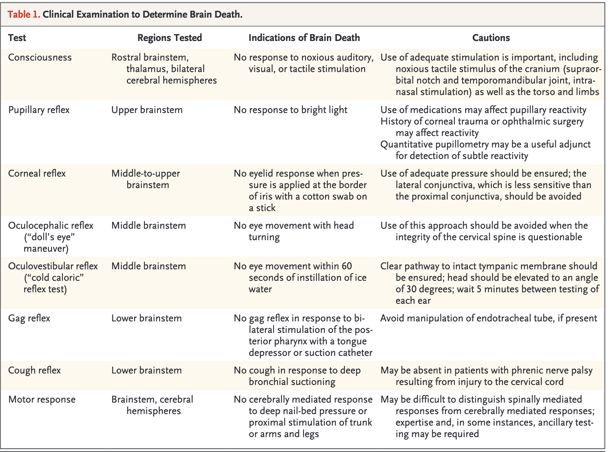

# Brain Death

Anna Berry

---

## Background

- Brain death= complete and permanent loss of brain function. Defined
    by coma with loss of capacity for consciousness, brainstem reflexes,
    and the ability to breathe independently

Checklist for Determination of Brain Death (American Academy of
Neurology)

1. Prerequisites (all must be checked)
    - Coma, irreversible and cause known
    - Neuroimaging explains coma – usually CT or MRI
    - Absence of CNS depressing drugs
    - No evidence of residual paralytics (electrical stimulation if
        paralytics used)
    - Absence of severe acid-base, electrolyte, endocrine abnormality
    - Normothermia or mild hypothermia (core temp \>36°C)
    - SBP ≥100 mm Hg
    - No spontaneous respirations
2. Examination (all must be checked) – Attending MUST be present for
brain death exam

<figure markdown>
  
  <figcaption>Greer DM, Determination of Brain Death. NEJM. 2021;385;2554-61. DOI:
0.1056/NEJMcp2025326</figcaption>
</figure>

3. Apnea testing (all must be checked) – Attending MUST be present
    - Pt is hemodynamically stable
    - Ventilator adjusted to provide normocarbia (PaCO2 35–45 mm Hg)
    - Preoxygenate with 100% FiO2 and PEEP of 5 cm water for \>10 minutes
        to PaO2 \>200 mmHg
    - Provide oxygen via a suction catheter to the level of the carina at
        6 L/min or attach T-piece with continuous positive airway pressure
        (CPAP) at 10 cm H2O
    - Disconnect ventilator
    - Spontaneous respirations absent
    - Arterial blood gas drawn at 8–10 minutes, patient reconnected to
        ventilator
    - PCO2 ≥60 mm Hg, or 20 mm Hg rise from normal baseline value; OR:
    - Apnea test aborted due to spontaneous respirations present,
        hemodynamic instability, or hypoxia
4. Ancillary testing (Order one test if clinical examination cannot be
fully performed due to patient factors or if apnea testing
inconclusive/aborted)
    - Cerebral angiogram
    - HMPAO SPECT (Single photon emission computed tomography)
    - EEG & TCD (transcranial Doppler)

## Organ donation caveats

- Discussions about organ donation should take place between Tennessee
    Donor Services (TDS) and the surrogate. You SHOULD NOT be having
    conversations with the surrogate about donation. Direct questions to
    TDS.
