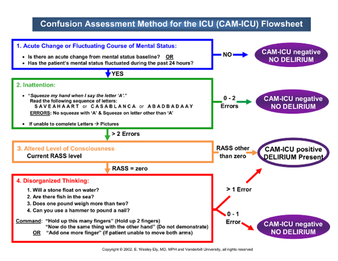

# Management of Shock

Alex Toporex, Soibhan Kelley

---

## Distributive Shock

### Background

- Pathophysiology: severe, peripheral vasodilation
- CO/CI increased, SVR decreased, PCWP and RAP normal to low
- Etiologies: sepsis (most common), anaphylaxis, neurogenic, adrenal
    insufficiency, pancreatitis
- Signs/symptoms:
    - Sepsis: localizing signs of infection; tachycardia, tachypnea, may
        be hypo/hyperthermic; POCUS with hyperdynamic cardiac function
    - Anaphylaxis: history of anaphylaxis; urticaria, edema, diarrhea,
        wheezing on exam
    - Neurogenic: history of CNS trauma; focal neurologic deficits on exam
    - Adrenal insufficiency: hx chronic steroid use, may have GI symptoms,
        hyponatremia (common), hyperkalemia (rare), hypoglycemia,
        hypo/hyperthermia, NAGMA
    - Pancreatitis: abdominal pain, elevated lipase, evidence on CT scan

### Management

- Sepsis: see sepsis section
- Anaphylaxis: 0.3mg IM epinephrine ASAP to be repeated q5-15min x 3;
    after third IM epi, consider IVF and epi gtt if persistent
    hypotension. Adjuncts: albuterol nebs for bronchospasm, H1 and H2
    blockers, +/- glucocorticoids (methylprednisolone 1mg/kg).
    EPINEPHRINE SAVES LIVES.
- Neurogenic: caution with IVF resuscitation, can worsen cerebral and
    spinal cord edema; preferred pressors are norepinephrine and
    phenylephrine; for neurogenic shock 2/2 spinal cord pathology,
    consider higher MAP goal 85-90 mmHg
- Adrenal insufficiency: stress dose steroids with hydrocortisone
    100mg IV q8hr or 50mg q6hr
- Pancreatitis: IVF + pressors; trend H/H and Ca; treat complications
    (necrotizing pancreatitis, abdominal compartment syndrome); address
    underlying etiology (see GI section)

## Cardiogenic Shock

### Background

- Pathophysiology: CO/CI decreased, SVR increased, PCWP and RAP
    elevated (left heart failure) or PCWP low/normal and RAP elevated
    (right heart failure)
- Etiologies: Cardiomyopathy (LHF, RHF or biventricular), arrhythmia,
    mechanical such as acute AR (ex: dissection) or MR (ex: ruptured
    papillary muscle)

### Presentation

- Edematous, elevated JVP, “cold and wet”; hypoxia w/crackles and pulm
    edema; mixed venous sat \< 50-60%; POCUS with plump,
    non-compressible IVC, reduced EF, and B-lines

### Management

See cardiogenic shock in cardiology section

## Hypovolemic Shock

### Background

- Etiologies: Hemorrhagic and non-hemorrhagic
- Signs/symptoms:
    - Hemorrhagic: Common sources include GI, retroperitoneal (\*needs
        high index of suspicion), traumatic, intraabdominal, thighs, thorax
    - Non-hemorrhagic: 2/2 GI losses or decreased PO intake
- POCUS with thin, collapsible IVC

### Management (Hemorrhagic)

- Ensure good access with two large-bore (at least 18G) IVs ideally in
    AC or above; Cordis or MAC CVC (can also use dialysis catheter, if
    necessary)
- Hyperacute bleed:
    - 1:1:1 ratio FFP:Plt:RBC (balanced resuscitation), massive
        transfusion protocol (MTP)
    - Monitor iCa and replete (citrated blood products will deplete Ca)
    - Minimize crystalloid if possible, w/primary use to prevent immediate
        hemodynamic collapse (contributes to coagulopathy, hypothermia,
        acidemia, trauma/surgery)
    - Permissive hypotension until source control/transfusions with
        arterial bleeds (high MAP/SBP -\> clot destabilization); trend POC
        lactate/exam to guide
    - Acute traumatic arterial bleed or post-partum hemorrhage consider
        TXA (1-2 gm bolus)
    - Reverse anticoagulation, if applicable
    - Vasopressors -\> generally poorly effective, would start with
        norepinephrine
    - Source control -\> GI, IR, or EGS
- Variceal bleed: See GI Bleeding section for specific management

### Management (Non-Hemorrhagic)

- Aggressive IVF resuscitation (balanced crystalloid); target MAP ≥65
- Can support BP during resuscitation with pressors (usually
    norepinephrine)

## Obstructive Shock

### Background

- Etiologies: Massive pulmonary embolism, tension pneumothorax, and cardiac
    tamponade
- Signs/symptoms:
    - Pulmonary embolism: acute hypotension, known DVT, evidence of R
        heart strain on EKG, POCUS w/enlarged RV, septal bowing, McConnell’s
        sign, ↑ BNP, PE on CTA
    - Tension pneumothorax: history of COPD or fibrotic lung disease,
        ventilated pts w/ high peak pressures, unilateral decreased BS on
        auscultation and tympany on percussion, POCUS without lung sliding,
        CXR w/ PTX and mediastinal shift
    - Cardiac tamponade: elevated JVP, muffled heart sounds, pulsus
        paradoxus, POCUS with diastolic collapse of RV and large pericardial
        effusion (best in subcostal window)

### Management

- Massive pulmonary embolism: see Pulmonary Embolism Section for
    specific management
- Tension PTX: needle decompression using 14-16G needle into the
    second intercostal space at the midclavicular line; call trauma
    surgery or fellow for chest tube ASAP
- Cardiac tamponade: STAT page cardiology or cardiothoracic surgery;
    can temporize hypotension with IVF resuscitation—500-1L IVF boluses
    (may not work if pt is euvolemic or hypervolemic); no proven benefit
    from inotropy (e.g., dobutamine)

# Sepsis

Charlie Oertli

---

## Background

Most recent definition (Sepsis-3): organ dysfunction from
    dysregulated host response to infection

- 2021 Surviving Sepsis Guidelines: SIRS, MEWS, NEWS superior to qSOFA
    for <u>screening</u> sepsis
- SIRS ≥2 of any of: 1) RR\>20, 2) T \<36 or \>38, 3) HR \>90, 4) WBC
    \<4 or \>12 or \>10% bands
- Septic Shock = sepsis + vasopressors + lactate \>2 meq/dL (Sepsis 3
    definition)
- Alternate screening systems you may see which are more
    <u>specific</u> and better at prognosis of in hospital mortality
    than SIRS:
    - Acute change in baseline SOFA score ≥2: P/F ratio, Plts, Tbili, SBP,
        GCS, Cr
    - "Quick" SOFA (qSOFA): ≥2 of AMS (GCS≤13), SBP≤100 mmHg, RR≥22/min

## Evaluation

- Cultures prior to antibiotics if possible (but don’t delay
    antibiotics just to get cultures)
- Consider sputum Cx, paracentesis, thoracentesis, wound Cx, LP, joint
    aspiration
- Lactate (even if not hypotensive)
- Imaging: x-ray, CT, or US of potential source

## Management

Source control: Remove old lines, chest tube for empyema, drain
    abscesses, etc

Antibiotics

- Early antibiotics: within 1 hour if septic shock, within 3 hours if
    sepsis
- Target organisms most likely to cause infection in suspected organ;
    if source unknown, start empiric broad-spectrum
- MRSA coverage - vancomycin/daptomycin/linezolid/ceftaroline
- Pseudomonas coverage - zosyn/cefepime/meropenem /cipro/gentamicin
- Pneumonia: add atypical coverage (azithromycin/levaquin; 2nd line
    doxycycline if prolonged QTC or elderly) if severe or being admitted
    to the ICU
- Fungal coverage for Candida: if neutropenic, TPN, abdominal surgery,
    prior antibiotics
- De-escalation: Once source is controlled, if abx duration is unknown
    use procalcitonin, culture susceptibilities, and clinical evaluation
    to help guide de-escalation

Resuscitation

- Give 1-3 L (≥30 mL/kg of body weight) of IV balanced crystalloid
    within first 3 hours
- Only give blood if Hb \< 7, unless evidence of bleeding or
    myocardial ischemia
- Monitor HR, BP, mental status, urine output – do NOT give
    beta-blockers to slow HR in the setting of sepsis unless dangerously
    high and limiting diastolic filling (discuss with fellow), this is
    an appropriate stress response
- Assess fluid responsiveness by leg raise (if BP improves with leg
    raise, give more fluids). Other options US IVC (mixed data), pulse
    pressure

Vasopressors

- Start if MAP not responsive to fluid resuscitation
- Target MAP \> 65mmHg, also monitor mental status, serum lactate, and
    urine output; may need higher goal for pts with chronic HTN
- Start with norepinephrine -- via central line, PICC, or port. Can
    run through peripheral IV (at least 18g, proximal to wrist) up to 15
    mcg/min for up to 48 hours if no central access
    - SOAP II trial: norepinephrine \> dopamine (less arrhythmias)
    - No upper limit of NE but can cause peripheral ischemia with
        prolonged use
- Add vasopressin at fixed dose of 0.04 units/min when NE dose \>= 50
    mcg/min
    - VASST trial: possible benefit for pts on 5-15 of NE; however,
        this was opposite of hypothesis and vasopressin is expensive
- Add epinephrine or dobutamine if low cardiac output
- Add phenylephrine for pts with tachyarrhythmias (reflex bradycardia)
- Consider Angiotensin II (discuss with fellow, needs MICU leadership
    approval) contraindicated with CHF and
    DVT/PE/clots/hypercoagulability
- Consider steroids if vasopressors failing or on steroids chronically
    hydrocortisone 100mg IV q8hr or 50mg IV q6hr for 5 to 7 days

# Temperature Abnormalities

Soibhan Kelley

---

## Hypothermia

### Background

- Core temperature \<35°C (95°F). Mild 32-35C (90-95F), moderate
    28-32C (82-90F), or severe \<28C (82F) +/- pulseless
- Ensure thermometer is “low-reading,” standard thermometers not
    accurate
- Core temperature can be measured w/ bladder catheter probe or
    esophageal probe (may be falsely ↑ if heated oxygen being
    delivered). Rectal temp can be used but is less accurate
- Etiologies:
    - Heat loss: Environmental, burns, iatrogenic (CRRT, cold IVF, massive
        transfusion protocol), vasodilatory drugs/toxins
    - Decreased heat production: endocrinopathies (hypothyroidism, adrenal
        insufficiency, hypopituitarism, hypoglycemia), thiamine deficiency
    - Impaired regulation: Spinal cord injury, hypothalamic lesions, drugs
        (classes including antihyperglycemics, beta blockers, sedatives,
        ETOH, alpha agonists, general anesthetics)
    - Multiple mechanisms: sepsis, pancreatitis, DKA

### Evaluation

- Infectious work-up
- POC blood glucose, TSH/FT4, cortisol, lipase, UA, UDS, EtOH level,
    additional tox as appropriate, DKA work-up if relevant
- Physical exam + history for exposures and trauma
- CBC, CMP, Lactate, ABG, CK, PT/PTT, Fibrinogen
- EKG

### Management
- Treat underlying cause \[see appropriate sections\]
- Mild hypothermia:
    - Passive external rewarming (PER): blankets, increase ambient
        temperature
    - Note that PER requires sufficient underlying physiologic reserve to
        generate heat. This is often impaired in elderly pts, malnutrition,
        sepsis
- Moderate hypothermia, refractory mild hypothermia, or cardiovascular
    instability:
    - Active external rewarming (AER): forced warm air (ie Bair Hugger),
        heated blankets, heat lamps, hot packs (consider burn risk)
- Severe hypothermia or refractory moderate hypothermia:
    - Active core rewarming: Warmed IV crystalloid (limited rewarming
        potential unless large volume but will decrease ongoing losses),
        warmed humidified inspired air, warmed bladder lavage
    - More extreme methods such as peritoneal/thoracic lavage more likely
        to be used in severe environmental cases in ED
- Pulseless severe hypothermia (“You aren't dead unless you are warm
    and dead”)
    - Continue CPR until re-warmed as severe hypothermia is
        neuroprotective and pts can have good neurologic outcomes despite
        hours of CPR
    - ACLS medications and shocks will have poor effectiveness; prioritize
        circulation (i.e. chest compressions) and rewarming
    - Consider ECMO (likely venoarterial if pulseless); would need
        transfer to CVICU
- Identify and manage complications: bradycardia/heart block,
    arrhythmias, shock, coagulopathy/DIC, rhabdo; rebound
    hyperkalemia/hypoglycemia with rewarming

## Fever and Hyperthermia

### Background

- Fever: T \>38.0°C (100.4°F) driven by hypothalamus activity in
    response to systemic triggers (i.e. cytokines); may use lower
    threshold for immunocompromised pts
- Hyperthermia: T \>41.0 C (105.8°F) uncontrolled heat production with
    failure of thermoregulation
- Infectious etiologies:
    - Considerations in the ICU include central-line associated blood
    stream infection, catheter-associated UTI, pneumonia (including
    ventilator-associated), sinusitis (esp in pts with NGT or ETT),
    *clostridium difficile*, acalculous cholecystitis
- Non-infectious etiologies:
- Drug fever
    - Difficult to distinguish from other causes; Can begin hrs-wks
        after starting a drug
    - Sources: antibiotics (penicillins, cephalosporins,
        sulfonamides), anticonvulsants (phenytoin, carbamazepine,
        phenobarbital), allopurinol, heparin, dexmedetomidine
    - Drugs of abuse with sympathomimetic activity (cocaine, meth,
        ecstasy)
    - Anticholinergic or salicylate intoxication
- Idiosyncratic drug reactions
    - Serotonin syndrome
    - Neuroleptic malignant syndrome
    - Malignant hyperthermia
- Transfusion reactions
- PE/DVT
- Endocrine: hyperthyroidism/thyroid storm, adrenal insufficiency
- CNS pathology (intracranial bleed/stroke, particularly hypothalamic
    region)
- Malignancy
- Heat stroke (exertional or non-exertional)
- Other inflammatory states: Pancreatitis, gout, pericarditis,
    pneumonitis

### Evaluation

- Infectious work-up +/- LP; may consider pan-scan if unable to
    identify source
- POC glucose, BMP, LFT, Mg/Phos, CBC w/diff
- Consider coags + fibrinogen (DIC), CK/UA (rhabdo), UDS,
    acetaminophen and salicylate levels, TSH/FT4, cortisol, lipase, ABG
- Review medication list: antibiotics, serotonergic drugs,
    anti-psychotics, recent sedation for OR or recently intubated with
    succinylcholine, dexmedetomidine
- Consider CT/MRI head

### Management

- Treat underlying etiology \[see appropriate sections\]
- Serotonin syndrome -\> stop serotonergic drugs; add cyproheptadine
- Malignant hyperthermia -\>activate malignant hyperthermia team; add
    dantrolene
- Cooling
    - Target \<38.0°C (100.4°F)
    - Surface cooling: Ice (bath, or ice packs more likely in our MICU),
        evaporative cooling with misted lukewarm water and fan
    - Internal cooling:
        Cold IV fluids
        (pharmacy keeps ~3L of cold LR on-hand, they will cool more if you call down and ask),
        dry ventilation (evaporative) with non-humidified nasal cannula or vent circuit
    - Avoid shivering -\> give opiates (except in serotonin syndrome),
        precedex, propofol, benzos, ketamine
- Antipyretics
    - Acetaminophen, NSAIDs
    - Block prostaglandin-mediated temperature elevations
    - Effective for most causes of fever- infection, pancreatitis, DVT/PE,
        pneumonitis
    - AVOID for true hyperthermia (ineffective and potentially harmful)
        -\> neuroleptic malignant syndrome, malignant hyperthermia,
        serotonin syndrome, heat stroke
- Monitor for complications
    - Rhabdo, DIC, arrhythmias
- If high suspicion for infection and not improving on antibiotics,
    consider other infectious etiologies including fungal (ex: candida)

# Modes of Oxygen Delivery

Blake Funke

---

| System                                                                   | L/min    | % O2      | Comments                                                                                                                                 |
|--------------------------------------------------------------------------|----------|-----------|------------------------------------------------------------------------------------------------------------------------------------------|
| Blow by (ex: Trach collar)                                               |          | 21-100%   |                                                                                                                                          |
| Nasal cannula                                                            | 1-8      | 25 – 45%  |                                                                                                                                          |
| Large bore nasal cannula                                                 | Up to 15 | Up to 65% | Can be identified by larger bore tubing (often green) and nose piece. Colloquially referred to as HFNC at VUMC, but true HFNC = optiflow |
| Venturi mask                                                             | 4 to 15  | 24 – 50%  | Actual FiO2 is dependent on patient effort                                                                                               |
| Non-rebreather                                                           | 10 to 15 | 65-95%    | Often used as a bridge to higher level of O2 therapy                                                                                     |
| HFNC: Optiflow (VUMC), AirVo (NAVA)                                                    | Up to 60 | 30-100%   | Delivers 0.5-1 cm/H2O of PEEP per 10L of flow                                                                                            |
| *\*Use of all of these modes requires a spontaneously breathing patient* |          |           |                                                                                                                                          |

## Non-invasive positive pressure ventilation

- CPAP
    - Indications: obstructive sleep apnea, tracheomalacia
    - Settings: CPAP, FiO2
- BiPAP
    - Indications: hypercapnic respiratory failure (RF), hypoxic RF,
        pulmonary edema, obstructive sleep apnea, obesity hypoventilation
        syndrome, RF 2/2 neuromuscular disease
    - Settings: IPAP, EPAP, FiO2, RR (sometimes)

<table>
<colgroup>
<col style="width: 19%" />
<col style="width: 19%" />
<col style="width: 16%" />
<col style="width: 44%" />
</colgroup>
<thead>
<tr class="header">
<th colspan="4">Invasive positive-pressure ventilation</th>
</tr>
</thead>
<tbody>
<tr class="odd">
<td>Mode</td>
<td>You set</td>
<td>Not set</td>
<td>Comments</td>
</tr>
<tr class="even">
<td>Pressure support (PS)</td>
<td>
PEEP

PS above PEEP

FiO2
</td>
<td>
TV

RR

Inspiratory flow
</td>
<td>Similar to Bipap. Frequently used for vent weaning / SBT. Requires
spontaneously breathing pt</td>
</tr>
<tr class="odd">
<td>Volume Control (AC/VC)</td>
<td>
PEEP

RR

TV

Inspiratory flow

FiO2
</td>
<td>Inspiratory pressure</td>
<td>
Mandates a minute ventilation; limits volutrauma (i.e. can
guarantee low tidal volume ventilation)

Primary mode used in MICU (mode used in major ARDS trials)
</td>
</tr>
<tr class="even">
<td>
SIMV

Synchronized Intermittent Mandatory Ventilation
</td>
<td>
PEEP

RR

TV

PS above PEEP

FiO2
</td>
<td></td>
<td>Pt gets VC breath for set rate, but if tries to breath over this
will get PS breath; VC and PS breaths are synchronized when able</td>
</tr>
<tr class="odd">
<td>Pressure Control (AC/PC)</td>
<td>
RR

Inspiratory Pressure

PEEP

Inspiratory Time (or I:E ratio)

FiO2
</td>
<td>TV</td>
<td>
Minimizes barotrauma (i.e. sets a max inspiratory pressure) does
not guarantee a specific minute ventilation (must monitor PCO2 with
blood gases)

Does not have natural ventilator alarms for protection – need to
increase low minute ventilation alarm threshold
</td>
</tr>
<tr class="even">
<td>
PRVC

Pressure Regulated Volume Control
</td>
<td>
PEEP

RR

TV

Inspiratory flow

Pressure max

FiO2
</td>
<td></td>
<td>
Adaptive pressure control (NOT actually a volume control mode);
tries to limit both barotrauma and volutrauma but if in conflict, minute
ventilation will drop (i.e. need to monitor PCO2 with blood gases like
any other PC mode)

Con: More the pt works, the less the ventilator does
</td>
</tr>
<tr class="odd">
<td>APRV / Bilevel</td>
<td>
PEEP (PLow)

Pressure High

Time Low

Time High

FiO2
</td>
<td>TV</td>
<td>
Long periods of inspiratory holds and very brief expirations
(i.e. releases), for refractory hypoxemia.

Often difficult to ventilate pts on this mode
</td>
</tr>
</tbody>
</table>

# Introduction to Vent Management

Jared Freitas

---

## Ventilator Settings

- See table in Modes of Oxygen Delivery for variables adjusted
    in each ventilator mode
- Trigger: what initiates a breath; time, flow, or pressure (pt
    triggers are flow and pressure)

## Static Ventilator Readouts
- Plateau pressure (Pplat): measure with inspiratory hold, assesses
    static lung compliance
- Auto-PEEP: measure with expiratory hold; occurs when volume of
    previous breath is not entirely expelled before the next breath is
    initiated

## Dynamic Ventilator Readouts
- Measured RR: in most modes, pt may trigger breaths above set RR; if
    set and measured RR match consider ↓ respiratory drive (sedation,
    neurologic injury) or iatrogenic over-ventilation
- VTi / VTe: tidal volume of inspiration (VTi) and expiration (VTe)
- VTi should approximately equal VTe, if not then concern for air leak
    (e.g. cuff leak or pneumothorax) or auto-PEEP
- Minute ventilation: calculated from VTe x RR; higher MV = more CO2
    clearance
- Peak pressure: highest pressure reached in the entire ventilator
    cycle

## Critical Non-ventilator hemodynamic readouts
- SpO2: if poor waveform or discordant with PaO2, may need serial ABG
- HR: quickest indicator of emergencies such as pneumothorax, PE,
    ventilator disconnection
- Blood pressure: positive pressure ventilation decreases preload and
    afterload; depending on the underlying pt physiology, increases in
    positive pressure may be detrimental or beneficial for BP

<table>
<colgroup>
<col style="width: 20%" />
<col style="width: 21%" />
<col style="width: 57%" />
</colgroup>
<thead>
<tr class="header">
<th>Alarm Type</th>
<th>What is causing the alarm?</th>
<th>Troubleshooting</th>
</tr>
</thead>
<tbody>
<tr class="odd">
<td>High Peak Pressure</td>
<td>Static compliance issue (stretch of the lung - doesn't change with
airflow) versus dynamic compliance issue (resistance of the circuit when
there is air flowing)</td>
<td>
Step 1: Check plateau pressure by performing inspiratory hold.
Must be in VC mode.

<strong>High Peak and Low Plateau</strong> = Dynamic compliance issue
High Resistance

<ul>
<li>
Check circuit tubing for excess water condensation or a kink. Ask
RT to disconnect and clear circuit
</li>
<li>
Check if patient is biting ETT bite block, pain
control/sedation
</li>
<li>
Incline suction to clear secretions or proximal mucous
plug
</li>
<li>
Auscultate for wheezing or stridor to indicate bronchospasm or
airway obstruction-&gt;give bronchodilators
</li>
</ul>

<strong>High Peak and High Plateau</strong> = Static compliance issue
Worsening alveolar process

<ul>
<li>
Emergencies to quickly assess for:
</li>
</ul>
<ul>
<li>
Tension pneumothorax (exam, US for lung sliding, CXR)
</li>
<li>
Main stem intubation (ask about any tube migration, listen to
breath sounds, CXR)
</li>
</ul>
<ul>
<li>
Consider worsening alveolar process leading to decreased lung
compliance: worsening pulmonary edema, PNA, DAH, ARDS or other
non-alveolar process such as new pleural effusion, obesity,
intraabdominal hypertension/compartment syndrome
</li>
</ul>
<ul>
<li>
CXR, US to assess for b-lines, tracheal aspirate, bronch,
etc
</li>
<li>
Treat according to etiology (chest tube, reposition ETT,
diuresis, abx, etc)
</li>
</ul></td>
</tr>
<tr class="even">
<td>Low Tidal Volume/Low Minute Ventilation (VE)</td>
<td>Pt is not getting the desired tidal volume/VE that was set in the
vent parameters. The alarm reports exhaled VE. May cause inadequate
ventilation, CO2 retention, potentially hypoxia</td>
<td>
<strong>Compare inspiratory tidal volumes (Vti) with expiratory
tidal volumes (Vte) on the ventilator. If Vti&gt;Vte, check for a leak
in the system</strong>

<ul>
<li>
Have RT check all connections
</li>
<li>
Listen for a cuff leak – can have RT check a cuff pressure and if
low then re-inflate-&gt;sometimes need to do an ETT exchange
</li>
<li></li>
</ul>

<strong>If low tidal volumes and no leak (ie. Vti = Vte) and RR
WNL</strong>

<ul>
<li>
Pt may need more support, ie switching to a different vent mode
(PS to PRVC). Discuss with RT or fellow
</li>
</ul>

<strong>If low RR and no leak and Vt at goal</strong>

<ul>
<li>
Patient may be oversedated
</li>
<li>
Ensure pt has a back-up rate in case they aren't triggering the
vent-&gt;may need to switch vent modes for this (i.e. take off pressure
support) or increase set/ventilator respiratory rate
</li>
</ul></td>
</tr>
<tr class="odd">
<td>Apnea</td>
<td>No breaths are being triggered by the vent your patient is NOT
breathing this is an emergency</td>
<td>
***<strong>Check that patient hasn't self-extubated, trach hasn't
fallen out, or been unhooked from vent***</strong>

If self-extubated or tracheostomy decannulated, then immediately
start bagging the patient (may need to bag from trach stoma if s/p
laryngectomy). Have nurse call staff assist so that patient can be
re-intubated if necessary or have trach team called to replace a fresh
(&lt;7 days old) trach
</td>
</tr>
</tbody>
</table>

# Acute Respiratory Distress Syndrome (ARDS)

Judd Heideman

---

## Background

- A syndrome of diffuse inflammation and injury of the alveoli and
    capillary endothelium leading to fluid and protein accumulation in
    the interstitium and alveoli, pulmonary edema, and hypoxemic
    respiratory failure; 30-50% mortality rate
- Triggers:
- Pulmonary
    - Pneumonia (viral and bacterial) • Lung contusion
    - Direct inhalation injury • Aspiration
    - Primary graft dysfunction of pulmonary transplant
- Extra-pulmonary
    - Sepsis (most common cause) • HSCT
    - Trauma • Burns
    - Massive blood transfusions/TRALI • Pancreatitis
    - Drugs (amiodarone, chemotherapy, cocaine, opioids)

## Evaluation

- Diagnosis: Berlin Criteria
- New or worsening respiratory symptoms beginning within one week of
    diagnosis
- New bilateral opacities present on chest radiograph or CT chest
    - Not explained by effusions, collapse of lobe/lung, or nodules
- Absence of left heart failure or volume overload
- Severity: based on PaO2/FiO2 ratio with a PEEP ≥ 5 cm H2O
- PaO2 = arterial partial pressure of O2 (requires ABG)
- FiO2 = fraction of inspired oxygen (expressed as a decimal between
    0.21 and 1.0)

|          | PaO2/FiO2 ratio | PEEP |
|----------|-----------------|------|
| Mild     | 201-300         | ≥5   |
| Moderate | 101-200         | ≥5   |
| Severe   | \<100           | ≥5   |

## Management

- Frequently requires intubation; non-invasive ventilation not a great
    treatment
- Low tidal volume (Vt) ventilation mortality benefit
- Goal Vt = 4-8 mL/kg of *predicted* body weight (obese patients don’t
    have bigger lungs)
- Plateau pressure goal: ≤30 cm H2O
- Oxygenation goal: PaO2 55-80 or SpO2 88-95%
- pH goal: ≥7.20, “permissive hypercapnia”
- Treat the underlying cause (see “Triggers” above)

# Refractory Hypoxemia

Amelia Muhs

---

## Background

- Inadequate arterial oxygenation despite high levels of inspired O2
    or the development of barotrauma in mechanically ventilated pts
- Generally start to consider the interventions below if needing FiO2
    \>80%
- Differential:
    - Worsening underlying primary process (e.g. progressive ARDS)
    - PE
    - Pneumothorax
    - Fluid overload
    - Ventilator-associated Pneumonia
    - New ARDS

## Evaluation

- Always get CXR STAT if pt has new or worsening O2 requirement
- ABG is frequently helpful as well
- Can use POCUS to check for lung sliding (pneumothorax) or RV
    enlargement/septal bowing/McConnell’s sign (RV strain in PE)

## Initial management

- Remember – if at any point the pt is rapidly decompensating, you can
    always disconnect them from the vent and bag them until they
    recover/while calling for help
- Early consideration of ECMO consult in appropriate pts (discuss with
    MICU fellow)
- Optimize fluid status consider diuresis/dialysis if not making urine
- Consider higher PEEP strategy
- Increased PEEP higher mean airway pressure, generally improves
    oxygenation especially with diffuse pulmonary pathologies
    - Exceptions may include certain focal/shunt pathologies (e.g.
        dense lobar PNA)
    - Worsening oxygenation may occur with overdistension of alveoli
        increase dead space ventilation; generally determined
        empirically at the bedside
- Titrate up slowly; generally do not exceed PEEP 18
    - Limited by high plateau pressures/barotrauma,
        overdistension/dead space ventilation, decreased preload/venous
        return
- ARDSnet FiO2/PEEP Tables: At VUMC we typically use the Lower PEEP
    table

- Other recruitment maneuvers
    - Reposition pt – can try elevating HOB or positioning so “good lung”
        is down
    - If concern for mucus plug, consider need for bronch
    - If concern for significant atelectasis can try recruitment maneuvers
        with the vent including sustained inflation (setting expiratory
        pressure to \~30 for \~30 seconds) and PEEP titration (setting PEEP
        to 20-25 and decreasing by 2cm at a time) – call the fellow before
        attempting

## Management Algorithm for Refractory Hypoxemia

- Inhaled vasodilators: Distribute preferentially to well-ventilated
    alveoli local vasodilation improved V/Q matching
- VUMC formulary preference: inhaled epoprostenol (aka Flolan)
- Alternatives: inhaled milrinone, inhaled nitric oxide
- Data suggest improved PaO2/FiO2; large RCT without evidence for
    mortality benefit
- Deep sedation (RASS -4 or -5)
    - Promotes ventilator synchrony
- Neuromuscular blockade (paralysis) – call your fellow before doing
    this
    - Rationale: maximal vent synchrony (eliminates residual chest
        wall/diaphragm tone)
    - Pt MUST be RASS -5 (need analgesia + sedation)
    - Trial one time IV push of vecuronium 0.1 mg/kg
    - If improved vent synchrony/oxygenation, consider cisatracurium
        (Nimbex) drip
    - Data are mixed ACURASYS 2010 (improved 90-day mortality but
        underpowered likely overestimating benefit); ROSE 2019 (no
        difference in 90-day mortality)
- Prone positioning (Need attending approval)
    - Pts with moderate to severe ARDS (PaO2/FiO2 ratio \< 150)
    - At VUMC, we use regular ICU beds and manually flip pts; cycle prone
        16 hrs/supine 8 hrs
    - When proning or supining a pt, always have a provider who can
        intubate in the room in case unplanned extubation occurs
    - Considerations: need a team of people to reposition, high risk of ET
        tube malposition, difficult to access lines/perform procedures, high
        risk of pressure injuries
    - Data: PROSEVA 2013 proning improved 28-day mortality; study
        complicated by imbalances between groups
- Alternative ventilator modes (usually Pressure Control or
    APRV/BiLevel/BiVent)
- APRV/BiVent should be avoided in people with bad obstructive lung
    disease, hemodynamic instability, refractory hypercarbia
- Venovenous (V-V) ECMO
    - Indications for hypoxemia:
        - PaO2/FiO2 \< 50 with FiO2 \>80% for \>3 hrs OR
        - PaO2/FiO2 \< 80 with FiO2 \>80% for \>6 hrs AND
        - Mechanical ventilation ≤ 1 week
    - Absolute Contraindications:
        - Poor short-term prognosis (e.g. metastatic cancer)
        - Irreversible, devastating neurologic pathology
        - Chronic respiratory insufficiency without the possibility for
            transplant
    - Can calculate RESP score predicts in-hospital survival with ECMO
    - CONSULT EARLY if a pt may be a candidate; allows ECMO team to assist
        with evaluation
    - Data:
        - CESAR 2009: improved 6-month survival without severe disability
        - EOLIA 2018 : no mortality benefit but 28% crossover from control
            to ECMO arm dilutes potential effects

# Refractory Hypercapnia

Amelia Muhs

---

## Background

- Inadequate clearance of CO2 leading to respiratory acidosis (pH ≤
    7.20) despite maximum RR&TV (i.e. minute ventilation) tolerated
    without causing barotrauma or autoPEEP
- Common causes:
    - Obstructive lung disease (COPD, emphysema, asthma)
    - Hypoventilation (sleep apnea, obesity, sedative medications (ie
        opiates), neuromuscular weakness, chest wall trauma, ascites/pleural
        effusion)
    - Increased CO2 load (shock, sepsis, malignant hyperthermia)
- Presentation:
    - Shortness of breath
    - AMS, somnolence
    - Hypoxemia
    - Tachycardia, hypertension (in some cases)

## Evaluation

- Physical exam, mental status, recent medications
- ABG or VBG – if increased PCO2 and normal pH, always treat the pH
    and not the PCO2 (i.e., may be compensated chronic hypercarbia and
    blowing off more CO2 may be harmful)

## Management Algorithm

- Special considerations
    - If history of OSA, make sure they are on home CPAP/BiPAP
    - If opiate related trial narcan
    - Bronchodilators for reactive airway diseases
- BiPAP
    - Contraindicated if pt unable to remove BiPAP mask on their own
    - Increase MV by increasing Δ between IPAP/EPAP or increasing RR
- Mechanical ventilation
    - Allows you to control rate and tidal volume (in Volume Control
        modes)
    - NOTE: some pts have higher minute ventilation on their own compared
        to mechanical ventilation (e.g., DKA); pt-specific considerations
        regarding intubation
    - To increase minute ventilation and CO2 clearance:
        - Increase RR
            - 30-35 is about as high as you can go
            - Need to keep in mind I/E time to avoid breath
                stacking/autoPEEP (gas trapped in lungs)
            - Some signs of autoPEEP include worsening hypotension and the
                expiratory limb on the flow waveform on the vent not
                returning to zero
        - Increase TV we usually start at 4-6mL/kg IBW. You can consider
            increasing to 8mL/kg IBW as long as plateau pressures remain \<
            30 cm H2O
            - Goal peak pressures ≤ 35 cm H2O / plateau pressures ≤ 30 cm
                H2O
- ARDS permissive hypercapnia (goal pH ≥ 7.2)
- V-V ECMO / Extracorporeal carbon dioxide removal (ECCO2R)
- Indications for hypercapnia:
    - Severe dynamic hyperinflation and/or severe respiratory acidosis
    - pH ≤ 7.25 with PaCO2 ≥ 60 for 6 hr with RR at 35/min and TV
        increased to target maximum MV while keeping plateau pressure ≤
        32 cm H2O
    - Similar considerations and contraindications as refractory hypoxemia
    (see above)
    - Benefits: Reduces work of breathing, promotes early ventilator
        weaning/extubating allows early mobilization and recovery

# Tracheostomy

Jared Freitas

---

## Indications

- Prolonged mechanical intubation and weaning
- Tracheal stenosis
- Acute airway obstructions (head and neck cancers)
- Trauma
- Neuromuscular disease

## Benefits of Tracheostomy vs ET tube

- Improved pt comfort and decreased need for sedation
- Reduced laryngeal damage
- Increased ability to communicate (i.e. speaking valve)
- May decrease risk of developing ventilator associated pneumonia
    (mixed data)
- May reduce time to wean from the vent and decrease time in the
    hospital (mixed data)

## Timing

- No mortality difference or ↓ in hospital length of stay for early
    (day 4) vs late (day 10)
- Generally performed after 2 weeks of intubation, but not backed by
    data
- Pts that might get tracheostomy earlier: anticipated prolonged
    mechanical ventilation (i.e. those with acute neurologic injury
    affecting spinal cord)

## Types of Tracheostomy Tubes

- Different brands: most common in hospital = Shiley
- Components:
    - Faceplate: keeps tube in place, has the model and size on it
    - Inner cannula: can be removed, cleaned and replaced in case of
        obstruction
    - Cuff (may or may not have): allows for pt to be ventilated; may
        prevent some aspiration
    - Fenestration (may or may not have): allow speaking without valve
- Common sizes:
    - Initial: 8-0; Standard downsizing: 6-0
    - Lengths: standard vs larger XLT (P = longer proximal end, D =
        longer distal end)
- Presenting on ICU rounds = size/cuff status/brand (e.g. 8-0 cuffed
    shiley)

## Speaking Valves

- Passy Muir Valve (PMV): one-way valve placed on the outer portion of
    the trach; air moves in with inspiration but is blocked and thus
    funneled up through the vocal cords during exhalation allowing for
    phonation
- Contraindication: severe upper airway obstruction or aspiration
    risk, copious secretions, decreased cognitive status, severe medical
    instability, or inability to tolerate cuff deflation
- IMPORTANT SAFETY PRINCIPLE: cuff must be deflated, since air needs
    to be able to travel back up the airway, if the cuff is not deflated
    and you put the PMV on, then pt cannot exhale

## Maintenance of Tracheostomy Tubes

- Inner cannula should be cleaned 2-3 times per day
- Daily stoma care should be initiated to prevent pressure ulcers and
    stoma infections
- As needed suctioning for secretions

## Complications and airway emergencies in a tracheostomy pt

- Hemorrhage (mild bleeding from surface vessels and granulation
    tissue is common, major bleeding is rare think erosion into
    brachiocephalic \[innominate\] artery)
- Airway damage subglottic or tracheal stenosis; tracheobronchitis
- Fistulas (tracheoarterial, tracheoesophageal)
- Unintended tracheostomy tube dislodgement:
    - Bag mask (use hand/gauze to occlude stoma) or intubate from above
        (i.e. through the mouth); if complete laryngectomy then must use
        stoma
    - Fresh trach (≤ 14 days): do NOT replace due to risk of misplacement
        into the mediastinum and loss of airway; airway management from
        above
    - Older trach: can be replaced at bedside with obturator by trained
        staff
    - All pts with trachs have a yellow sign above bed with date, type,
        size of trach as well as a replacement trach with obturator in the
        room

## Secretion Management

- Respiratory hygiene (“pulmonary toilet”): heated vent, guaifenesin,
    hypertonic saline, duonebs, cough assist device, appropriate
    suctioning (too much = worsen secretions), acapella, inspiratory
    spirometer

# ABCDEF (A2F) Bundle

Kaele Leonard

---

## Background

- Post-Intensive Care Syndrome (PICS): complex constellation of
    cognitive, physical, and psychological impairments that impact most
    survivors of critical illness, leading to disability, frailty, and
    poor quality of life
- Predicted by (1) duration of immobility and (2) delirium
- Both are reduced by \>80% compliance with ABCDEF (A2F) Bundle
    concepts
- ABCDEF (A2F) Bundle: Interprofessional, evidence-based safety bundle
    of care principles to help reduce LOS, mortality, bounce-backs, and
    the duration of ICU delirium and coma
- Goal: allow pt to “prove us wrong” about readiness for liberation
    from devices, sedatives, etc.

**A**ssess, prevent, and manage pain

- Tools to assess pain using facial expressions, body movements,
    muscle tension, compliance with ventilator, or vocalization for
    extubated pts
- Ex: Critical Care Pain Observation Tool (CPOT): scale 0-8,
    uncontrolled pain 3
- Uncontrolled pain increases risk for delirium, limits inspiratory
    effort & weaning from ventilator, and limits ability to mobilize
- Treatment: multi-modal: parenteral opioids, neuropathic meds (e.g.,
    gabapentin, ketamine), adjunctive non-opioids analgesics (e.g.,
    acetaminophen, NSAIDs), nonpharmacologic interventions
    (repositioning, heat/cold)

**B**oth spontaneous awakening trials (SATs) and spontaneous breathing
trials (SBTs)

- SATs = daily sedative interruptions
- RN-driven protocol involving safety checklist: no active seizures,
    alcohol withdrawal, agitation, paralytics, myocardial infarction, or
    increased ICP
- If pass SAT, then proceed to SBT
- If fail SAT (anxiety, agitation, pain, resp distress) restart
    sedation at ½ doses
- SBTs = PS ventilation (Fi02 ≤ 50%, PEEP ≤ 7.5; typically 40% and
    5/5) for ≥ 30 minutes
- RT or physician/APP-driven protocol with safety screen: passed SAT,
    O2 sat ≥ 88%, inspiratory efforts, no myocardial ischemia, no/low
    vasopressor support
- If pass SBT, physician/APP judgment on extubation
- If fail SBT (RR \> 35 or \< 8, O2 sat \< 88%, resp distress, mental
    status change) restart full ventilatory support
- Evidence:
    - Liberated pts from mechanical ventilation 3 days sooner, decreased
        ICU and hospital length of stay by 4 days, and 14% absolute
        reduction in mortality at 1 year

**C**hoice of analgesia and sedation

- Richmond Agitation-Sedation Scale (RASS): sedation & level of
    arousal assessment tool (Figure 1)
- Target light sedation of RASS -1 to 0 with goal of (1) pt following
    commands without agitation and (2) limiting immobilization
- Over-sedation: hold sedatives till target, then restart at ½ prior
    dose
- Analgosedation with focus on treating pain first and then adding
    sedation meds PRN
- Sedatives: dexmedetomidine (dex) or propofol \>\>\> benzodiazepines
- Benzodiazepines increase risk of delirium in a dose-dependent
    fashion

<figure markdown>
  
  <figcaption> Figure 1: Richmond Agitation-Sedation Scale (RASS) Delirium - assess, prevent, and manage</figcaption>
</figure>

**D**elirium- assess, prevent, and manage

- Screening for delirium: q4hr using CAM-ICU (Figure 2)
- Affects 60-80% of ventilated pts and associated with increased
    morbidity and mortality, longer ICU and hospital length of stay,
    long-term cognitive dysfunction
- Risk factors and treatment: see Delirium section in Psychiatry

**E**arly mobility and exercise

- Prolonged immobilization during critical illness leads to
    ICU-acquired weakness, associated with worse outcomes: ↑ mechanical
    ventilation, increased hosp length of stay, greater mortality, and
    greater disability
- Consult PT/OT to initiate rehab at the beginning of critical illness
- Can be done safely in pts receiving advanced support

**F**amily engagement and empowerment

- Especially important when pts are unable to communicate themselves
- Incorporate family at the bedside and on rounds to learn pt
    preferences and values, engage in shared-decision making, and
    address questions and concerns

<figure markdown>
  
  <figcaption></figcaption>
</figure>

# Brain Death

Anna Berry

---

## Background

- Brain death= complete and permanent loss of brain function. Defined
    by coma with loss of capacity for consciousness, brainstem reflexes,
    and the ability to breathe independently

Checklist for Determination of Brain Death (American Academy of
Neurology)

1. Prerequisites (all must be checked)
    - Coma, irreversible and cause known
    - Neuroimaging explains coma – usually CT or MRI
    - Absence of CNS depressing drugs
    - No evidence of residual paralytics (electrical stimulation if
        paralytics used)
    - Absence of severe acid-base, electrolyte, endocrine abnormality
    - Normothermia or mild hypothermia (core temp \>36°C)
    - SBP ≥100 mm Hg
    - No spontaneous respirations
2. Examination (all must be checked) – Attending MUST be present for
brain death exam

<figure markdown>
  
  <figcaption>Greer DM, Determination of Brain Death. NEJM. 2021;385;2554-61. DOI:
0.1056/NEJMcp2025326</figcaption>
</figure>

3. Apnea testing (all must be checked) – Attending MUST be present
    - Pt is hemodynamically stable
    - Ventilator adjusted to provide normocarbia (PaCO2 35–45 mm Hg)
    - Preoxygenate with 100% FiO2 and PEEP of 5 cm water for \>10 minutes
        to PaO2 \>200 mmHg
    - Provide oxygen via a suction catheter to the level of the carina at
        6 L/min or attach T-piece with continuous positive airway pressure
        (CPAP) at 10 cm H2O
    - Disconnect ventilator
    - Spontaneous respirations absent
    - Arterial blood gas drawn at 8–10 minutes, patient reconnected to
        ventilator
    - PCO2 ≥60 mm Hg, or 20 mm Hg rise from normal baseline value; OR:
    - Apnea test aborted due to spontaneous respirations present,
        hemodynamic instability, or hypoxia
4. Ancillary testing (Order one test if clinical examination cannot be
fully performed due to patient factors or if apnea testing
inconclusive/aborted)
    - Cerebral angiogram
    - HMPAO SPECT (Single photon emission computed tomography)
    - EEG & TCD (transcranial Doppler)

## Organ donation caveats

- Discussions about organ donation should take place between Tennessee
    Donor Services (TDS) and the surrogate. You SHOULD NOT be having
    conversations with the surrogate about donation. Direct questions to
    TDS.

# MICU/CCU Drips

Patrick Barney

---

Most have order sets in Epic. Typically choose “Titration Allowed” in
ICU

<table>
<colgroup>
<col style="width: 21%" />
<col style="width: 17%" />
<col style="width: 16%" />
<col style="width: 23%" />
<col style="width: 20%" />
</colgroup>
<thead>
<tr class="header">
<th colspan="5">Vasopressors:</th>
</tr>
</thead>
<tbody>
<tr class="odd">
<td>Drug</td>
<td>Dose</td>
<td>Receptors</td>
<td>Indications</td>
<td>Considerations</td>
</tr>
<tr class="even">
<td><strong>Norepinephrine (Levophed)</strong></td>
<td>1 – 100 mcg/min</td>
<td>αα1 &gt; β1</td>
<td>1st line septic shock</td>
<td>Peripheral ischemia, skin necrosis</td>
</tr>
<tr class="odd">
<td><strong>Phenylephrine (Neosynephrine)</strong></td>
<td>
Bolus: 0.05 – 0.5 mg q 10-15 min

Infusion: 40-360 mcg/min
</td>
<td>αα1</td>
<td>Periprocedural hypotension (Neostick), pts w/ tachyarrhythmias,
Critical AS or HOCM with severe LVOT obstruction and shock</td>
<td>Reflex bradycardia, Peripheral ischemia, skin necrosis</td>
</tr>
<tr class="even">
<td><strong>Epinephrine</strong></td>
<td>1 – 40 mcg/min</td>
<td>αα1=β1=β2</td>
<td>Post PEA arrest, Anaphylaxis, Septic shock (severe), Cardiogenic
shock</td>
<td>Tachy-arrhythmias, Peripheral ischemia, skin necrosis</td>
</tr>
<tr class="odd">
<td><strong>Vasopressin</strong></td>
<td>0.04 U/min (no titration)</td>
<td>V1, V2, V3</td>
<td>2nd line septic shock, Right heart failure</td>
<td>Hyponatremia, Bradycardia</td>
</tr>
<tr class="even">
<td>
<strong>ANG II</strong>

<strong>needs approval from MICU leadership</strong>
</td>
<td>20 – 40 ng/kg/min</td>
<td>ANG II</td>
<td>Refractory vasodilatory shock</td>
<td>Thrombosis pt MUST have chemical DVT ppx. Contraindicated in heart
failure</td>
</tr>
<tr class="odd">
<td><strong>Dopamine</strong></td>
<td>2 – 20 mcg/kg/min</td>
<td>Dopamine (1-5 mcg) &gt; β1 (5-10 mcg) &gt;α1 (&gt;10mcg)</td>
<td>Hypotension, Cardiogenic shock</td>
<td>Tachy-arrhythmias, peripheral ischemia, skin necrosis</td>
</tr>
<tr class="even">
<td><strong>Dobutamine</strong></td>
<td>2.5 – 20 mcg/kg/min</td>
<td>β1 &gt;&gt;&gt; β2</td>
<td>Cardiogenic shock</td>
<td>Vasodilation Hypotension, Tachycardia, Tachyphylaxis</td>
</tr>
<tr class="odd">
<td><strong>Milrinone</strong></td>
<td>0.375 – 0.75 mcg/kg/min</td>
<td>PDE-3</td>
<td>Cardiogenic shock</td>
<td>Hypotension, renally cleared</td>
</tr>
</tbody>
</table>

<table>
<colgroup>
<col style="width: 22%" />
<col style="width: 10%" />
<col style="width: 10%" />
<col style="width: 11%" />
<col style="width: 9%" />
<col style="width: 12%" />
<col style="width: 11%" />
<col style="width: 11%" />
</colgroup>
<thead>
<tr class="header">
<th colspan="8">Sedatives/Anxiolytics:</th>
</tr>
</thead>
<tbody>
<tr class="odd">
<td>Drug</td>
<td colspan="2">Dose</td>
<td colspan="2">Class</td>
<td colspan="3">Side effects</td>
</tr>
<tr class="even">
<td><strong>Propofol</strong></td>
<td colspan="2">Infusion: 5 – 150 mcg/kg/min</td>
<td colspan="2">General anesthetic (GABA R agonist)</td>
<td colspan="3">
Severe hypotension, bradycardia,
hypertriglyceridemia, propofol infusion syndrome (rare)

Monitor for toxicity with q4 day TGs and CK
</td>
</tr>
<tr class="odd">
<td><strong>Dexmedetomidine (Precedex)</strong></td>
<td colspan="2">Infusion: 0.1 – 1.5 mcg/kg/h</td>
<td colspan="2">Central αα2 agonist</td>
<td colspan="3">Hypotension, bradycardia</td>
</tr>
<tr class="even">
<td><strong>Midazolam (Versed)</strong></td>
<td colspan="2">
Push: 0.5 – 5 mg

Infusion: 0.25 – 5 mg/h (no max dose)
</td>
<td colspan="2">Benzodiazepine</td>
<td colspan="3">Hypotension, risk of BNZ withdrawal if used for long
periods with sudden discontinuation</td>
</tr>
<tr class="odd">
<td><strong>Lorazepam (Ativan)</strong></td>
<td colspan="2">
Push: 0.5 – 10 mg

Infusion: 0.5 – 5 mg/h (no max dose)
</td>
<td colspan="2">Benzodiazepine</td>
<td colspan="3">Hypotension, propylene glycol carrier - AGMA</td>
</tr>
<tr class="even">
<td><strong>Ketamine</strong></td>
<td colspan="2">
Push: 1-2mg/kg

Infusion: 0.2mg/kg/hr, titrate by 0.1 q15min
</td>
<td colspan="2">NDMA antagonist</td>
<td colspan="3">
Delirium/hallucination – use caution in patients with
psychiatric hx, hypertension, tachycardia

Pretreat with 0.4mg IV glycopyrrolate to avoid
hyper-salivation
</td>
</tr>
<tr class="odd">
<td> </td>
<td> </td>
<td> </td>
<td> </td>
<td> </td>
<td> </td>
<td> </td>
<td> </td>
</tr>
</tbody>
</table>

<table>
<colgroup>
<col style="width: 21%" />
<col style="width: 29%" />
<col style="width: 48%" />
</colgroup>
<thead>
<tr class="header">
<th colspan="3">Analgesic:</th>
</tr>
</thead>
<tbody>
<tr class="odd">
<td>Drug</td>
<td>Dose</td>
<td>Side effects</td>
</tr>
<tr class="even">
<td><strong>Fentanyl</strong></td>
<td>
Push: 25 – 100 mcg

Infusion: 25 – 400 mcg/h
</td>
<td>Hypotension, Serotonin syndrome, chest wall rigidity at high
doses</td>
</tr>
<tr class="odd">
<td><strong>Morphine</strong></td>
<td>
Push: 1 – 5 mg q1-2h prn

Infusion: 1 – 5 mg/h
</td>
<td>Hypotension (profound), itching, constipation, HA; avoid in renal
failure</td>
</tr>
<tr class="even">
<td><strong>Hydromorphone (Dilaudid)</strong></td>
<td>
Push: 0.25 – 1 q1-2h prn

Infusion: 0.5 – 3 mg/h
</td>
<td>Hypotension, respiratory depression, itching</td>
</tr>
</tbody>
</table>

<table style="width:100%;">
<colgroup>
<col style="width: 16%" />
<col style="width: 15%" />
<col style="width: 19%" />
<col style="width: 13%" />
<col style="width: 16%" />
<col style="width: 18%" />
</colgroup>
<thead>
<tr class="header">
<th colspan="6">Anti-hypertensives</th>
</tr>
</thead>
<tbody>
<tr class="odd">
<td>Drug</td>
<td>Class/MOA</td>
<td>Dose</td>
<td>Indications</td>
<td>Side effects</td>
<td>Comments</td>
</tr>
<tr class="even">
<td><strong>Esmolol</strong></td>
<td>Beta blocker</td>
<td>
Bolus: 1mg/kg over 30s

Infusion: 50-300mcg/kg/min (max 300)
</td>
<td>Aortic dissection, HTN emergency</td>
<td>Bradycardia, hypotension</td>
<td>Titrate to desired BP or HR. Caution in HFrEF</td>
</tr>
<tr class="odd">
<td><strong>Nicardipine</strong></td>
<td>CCB</td>
<td>Infusion: 5-15mg/hr (max 15)</td>
<td>HTN emergency</td>
<td>Bradycardia, hypotension</td>
<td>Titrate to desired BP, avoid in HFrEF</td>
</tr>
<tr class="even">
<td><strong>Nitroprusside</strong></td>
<td>Metabolized to NO vasodilatory effect (arterial roughly =
venous)</td>
<td>Infusion: 0.3mcg/kg/min; titrate q2min to max 10mcg/kg/min</td>
<td>HTN E, flash pulmonary edema, HFrEF for afterload reduction</td>
<td>Hypotension, cyanide toxicity</td>
<td>Contraindicated in hepatic and renal failure</td>
</tr>
<tr class="odd">
<td><strong>Nitroglycerin</strong></td>
<td>NO mediated venous &gt; arterial vasodilation</td>
<td>Infusion: start 0.25mcg/kg/min, titrate by 1mcg/kg/min q15min (max
10mcg/kg/min)</td>
<td>Refractory angina, flash pulmonary edema, HTN emergency</td>
<td>Hypotension, headache, palpitations</td>
<td>Contraindicated in severe RHF and concurrent use of PDE-5
inhibitor</td>
</tr>
</tbody>
</table>

<table>
<colgroup>
<col style="width: 16%" />
<col style="width: 17%" />
<col style="width: 15%" />
<col style="width: 20%" />
<col style="width: 30%" />
</colgroup>
<thead>
<tr class="header">
<th colspan="5">Anti-Arrhythmics:</th>
</tr>
</thead>
<tbody>
<tr class="odd">
<td>Drug</td>
<td>Dose</td>
<td>Indications</td>
<td>Side effects</td>
<td>Comments</td>
</tr>
<tr class="even">
<td><strong>Adenosine</strong></td>
<td>6 – 12 mg IV rapid push and flush; may repeat x2</td>
<td>PSVT conversion</td>
<td>Complete AV nodal blockade</td>
<td>
10 second half-life

 Must have continuous EKG/tele monitor
</td>
</tr>
<tr class="odd">
<td><strong>Amiodarone</strong></td>
<td>
ACLS: 300 mg IV push

Non-emergent: 150 mg over 10 min then 0.5 mg/min
</td>
<td>Vtach/Vfib, Afib</td>
<td>Pulm, ophthalmic and thyroid toxicity w/ chronic use</td>
<td>Less hypotension than other agents, safe in heart failure. May
chemically cardiovert patients, caution if off therapeutic AC</td>
</tr>
<tr class="even">
<td><strong>Diltiazem</strong></td>
<td>
Push: 10 – 20 mg q15 min x 2 if no response

Infusion: 5 – 15 mg/h
</td>
<td>Afib, Aflutter, PSVT</td>
<td>Bradycardia, hypotension</td>
<td>Avoid use in pts with HFrEF</td>
</tr>
<tr class="odd">
<td><strong>Lidocaine</strong></td>
<td>
ACLS: 1 mg/kg x 1

Infusion: 1 – 4 mg/min
</td>
<td>Vtach</td>
<td>Bradycardia, Heart block</td>
<td>Avoid use in liver failure/ Okay for HFrEF. Often 1st
line CCU med for VT/ May need to check levels if using for longer than
24 hours</td>
</tr>
<tr class="even">
<td><strong>Procainamide</strong></td>
<td>15 mg/kg over 30 min then 1 – 6 mg/min</td>
<td>Vtach, refractory afib</td>
<td>Bradycardia, hypotension</td>
<td>Drug-induced lupus, cytopenias</td>
</tr>
</tbody>
</table>

# Intubation and Extubation

Daniel Motta-Calderon

---

## Intubation

### Background

- Intubation is the definitive therapy for patients with worsening
    respiratory failure
- Indications for intubation- hypoxic or hypercarbic respiratory
    failure, airway protection

### Intubation checklist

- Prepare the patient
    - IV access: at least two large bore IV access sites.
    - Optimize position: Supine sniffing position
    - Assess the airway: Assess for difficult intubation predictors
        (opening mouth \<3cm, Mallampati ≥ III, neck circumference \>40cm,
        thyromental distance \<6cm, head-neck extension \<30 degrees)
    - Optimal pre-oxygenation: using FiO2 100% (facemask, high flow
        nasal cannula)
    - Optimize medical status: resuscitation, temporize hyperkalemia,
        Hb \>7
- Prepare the equipment
    - Monitoring: SpO2, capnography, telemetry, BP
    - Equipment: bag valve mask, 2 endotracheal tubes (ETT) with cuffs
        checked, direct laryngoscope, videolaryngoscope, bougie/stylet,
        working suction, supraglottic airway, oropharyngeal airway
    - Medications: paralytic (ex: rocuronium, succinylcholine),
        induction sedative (ex: etomidate, ketamine, propofol), analgesics
        (ex: fentanyl), maintenance sedative, IVF hanging in room, pressors
        (ex: Neostick)
- Prepare the team
    - First and second intubators, RT, RN, someone to monitor hemodynamics

### Rapid-sequence intubation (RSI)

- Preferred method of induction, associated with increased
    first-attempt success and fewer intubation-related complications
- Simultaneous IV administration of rapidly acting paralytic and
    induction agents to achieve sedation and paralysis

### Post-intubation

- Ensure correct placement of ETT with capnography and confirming
    bilateral breath sounds
- Secure ETT with taping, tying or tube holder
- Obtain post-placement CXR

### Immediate complications of intubation

- Aspiration: Suction airway, ideally prior to initiation of positive
    pressure ventilation to prevent distal movement of aspirated
    contents. Cricoid pressure maneuver historically used to reduce risk
    but unclear if it works so often not performed
- Cardiovascular collapse: May be hypotension or sympathetic surge
    (hypertension, tachycardia, arrhythmias). Manage with
    fluids/pressors if need, rule out other causes (ex: hypoxia, PTX)
- Hypoxemia: Preoxygenate with 100% FiO2 to minimize risk. Rescue
    maneuvers with bag mask ventilation if needed
- Mechanical injury: Dental, soft tissue, tracheal, laryngeal.
    Retrieve any dislodged teeth, suction blood

## Extubation

### Is the patient ready to be extubated?

- Are they oxygenating well? SpO2 ≥90% with FiO2 ≤50% and PEEP ≤8cm
    H20
- Has the underlying cause of their respiratory failure improved?
- Did patient pass their SBT?
    - See ABCDEF Bundle section for details on SBT
- Is patient able to protect their airway?
- Is the patient on a stable pressor requirement or no pressors?
- Is patient coughing and clearing secretions?
- Is patient off sedation, alert and following commands?
- Positive cuff leak? (See below for steps)
- Consider calculating the rapid shallow breathing index (RSBI):
    RR/tidal volume (L)
    - Set PS at 0cm H2O, and PEEP at 5cm H2O and, measure VT & RR for
        one minute.
    - RSBI ≥ 105 predicts likely failure to wean. The use of a RSBI is
        attending dependent at Vanderbilt and is not frequently
        calculated when assessing readiness for extubation

### Post-extubation complications

- Post-extubation stridor: 2/2 laryngeal edema
- Positive cuff leak test= high risk methylprednisolone 20 mg IV q4h
    x 4 prior to extubation to prevent
- If after extubation: Methylprednisolone 40 mg IV x1 dose + inhaled
    racemic epinephrine. If stridor \>60minutes, consider reintubation
- Cuff leak test:
    - Suction secretions and set the ventilator into the AC mode
    - Inflate the cuff and record inspiratory and expiratory VT to
        evaluate for differences between the two volumes
    - Deflate the cuff record the expiratory VT over the next six
        breathing cycles. Average the three lowest expiratory VT values
    - The cuff leak volume is the difference between the inspiratory
        VT (measured before the cuff was deflated) and the averaged
        expiratory VT. If the difference is \<100cc, this is considered
        failure but is not an absolute contradiction to extubation
- Post-extubation respiratory failure
    - Recurrent hypoxic or hypercarbic respiratory failure
    - Assess for aggravating factors (volume overload, shock, AMS, etc)
    - For hypercarbic respiratory failure, may trial BiPAP. If
        unsuccessful reintubate
    - Preventative post-extubation BiPAP not routinely used in all
        patients but *consider* in select populations at high risk for
        failure: severe COPD with preexisting chronic hypercarbia during
        SBT, patients intubated for cardiogenic pulmonary edema

# Ultrasound in Critical Care

Audrey White

---

## Volume assessment

- IVC measurements
- Clinical Questions: Will the patient respond to fluid resuscitation?
    Is CVP low or high?
- Protocol: See cardiology POCUS section
- Limitations: Non applicable in patients with elevated abdominal
    pressure or abdominal contractions during measurement
- Troubleshooting: Use the liver as a window to the IVC to avoid bowel
    gas. Start at the right mid-axillary line with the leading edge
    toward the head of the patient, and fan to view the IVC in
    longitudinal axis.

## Lung Assessment

- Lung ultrasound relies on recognition of ultrasound artifacts to
    identify normal and pathologic findings.
- Normal findings
    - “Bat sign”: Ultrasound cannot penetrate reflective rib surface,
        casting a vertical shadow
    - A- lines: hyperechoic horizontal lines descending from the
        pleural line at regular intervals. This reverberation artifact
        occurs in normal aerated lung
- Pathologic findings
    - B-lines, comet tails: Vertical hyperechoic lines which (1)
        extend from the pleural line through the depth of the image, (2)
        move with lung sliding, and (3) obliterate A lines. Multiple B
        lines indicates excess interstitial fluid
    - Lung rockets: \>3 B lines indicates interstitial syndrome. Most
        common cause is acute pulmonary edema, also consider ARDS, PNA,
        pulmonary fibrosis, & pulmonary contusion. Helps distinguish CHF
        vs COPD exacerbation in patients with dyspnea
    - Loss of lung sliding, barcode sign: The shimmering, twinkling
        appearance of the dynamic aerated lung is lost. Can confirm in
        M-mode with barcode sign- smooth homogenous lines indicating no
        movement of lung tissue. Lung sliding=suspicion for PTX but NOT
        specific unless can identify lung point
    - Lung Point: The precise location where the lung detaches from
        the pleura can sometimes be identified. Can confirm in M-mode
        which will show “barcode” and “seashore” patterns adjacent. 100%
        specific for pneumothorax
    - Pleural effusion, jellyfish sign: Anechoic fluid is visualized
        between the diaphragm and dynamic lung
- Probe: linear or phased array
- Protocol
    - Adjust the depth to \~10cm to start. Position the probe vertically
        on the midclavicular line. Slide the probe so that the hyperechoic
        pleural line is visualized between rib shadows. Note
        presence/absence of A lines, B lines, lung sliding, and alveolar
        consolidation
    - Repeat on the opposite side and lower anterior lung fields
    - Repeat on the right and left mid-axillary line, upper and lower
            lung fields. Look for pleural effusion between the diaphragm and
            lung
    - Repeat on the posterior lung fields if indicated to complete a
            12-zone lung examination

## Cardiovascular

Goal-directed echocardiography for acute shock

- Pericardial tamponade
    - Apical 4 chamber (A4C): pericardial effusion, may see end diastolic
        collapse of right atrium
    - Parasternal long (PLAX): pericardial effusion will appear anterior
        to thoracic descending aorta, may see collapsing right ventricle
    - False positives: pericardial cyst, pericardial fat pad, pleural
        effusion (posterior to thoracic descending aorta on PLAX)
- Acute cor pulmonale
    - PLAX, PSAX: paradoxical septal motion, D shaped left ventricle,
        dilated RV
    - A4C: end-diastolic RV area : LV area \> 1
    - Subxiphoid (SUX): dilated IVC
- LVEF- see cardiology section

## Abdominal assessments

- FAST exam
- Clinical questions: Is there fluid in the peritoneal or pericardial
    spaces?
- Probe: curvilinear or phased array
- Protocol
    - Start on abdominal mode at depth 21-25cm. Assess for pericardial
        effusion in SUX view
    - Reduce depth to 12-16cm and place probe on the right anterior
        axillary line between ribs 8-12 with the indicator toward the
        patient’s head. Sweep medially to identify the right kidney.
        Assess for anechoic fluid in Morrison’s pouch between the kidney
        and liver, subdiaphragmatic space, and paracolic gutter. Rock
        the probe to assess for fluid cephalad to the diaphragm. Slide
        inferiorly to confirm no fluid around the inferior pole of the
        kidney
    - Place probe on the left anterior axillary line between ribs 8-11
        with the leading edge toward the patient’s head. Sweep medially
        to identify the left kidney. Assess for anechoic fluid in the
        splenorenal interface, subdiaphragmatic space, pleural space,
        paracolic gutter, and left kidney inferior pole
    - Place probe midline just superior to the pubic symphysis.
        Identify the bladder in longitudinal and transverse view. Assess
        for fluid outside the bladder wall and in the pouch of Douglas
        (females) or rectovesicular space (males)
- Limitations: Cannot detect retroperitoneal bleed. False positives
    from ascites, pleural effusion, subcapsular hematoma, ruptured
    cysts, physiologic fluid in pouch of Douglas, epicardial fat pad.
    Exam may be indeterminant if significant bowel gas or obesity
- Small bowel obstruction assessment
    - Overall SBO ultrasound has \~92% sensitivity and \~97% specificity
        to detect SBO and greater diagnostic accuracy than abdominal XR
    - Probe: curvilinear
    - Protocol: Have the patient lie supine and relax the abdominal wall.
        Place the probe vertically on the abdomen and sweep across all four
        quadrants in sagittal view. Repeat in transverse view. Measure small
        bowel wall thickness and diameter using the caliper tool
    - Signs of SBO:
        - Diameter \> 2cm • Decreased peristalsis
        - Wall thickness \> 4mm • Back and forth stool movement
        - Tanga sign: In severe SBO, may see triangular pocket hypoechoic
            free fluid surrounding the small bowel near the obstruction
- Renal ultrasound
    - Protocol is similar to FAST exam. Fan the probe through each kidney
        in sagittal and transverse view to assess for dilation of the
        collecting ducts. To move the kidney inferiorly, ask the patient to
        take a deep breath
    - Bilateral hydronephrosis and full bladder suggests urinary
        obstruction distal to the ureter
    - Unilateral hydronephrosis suggests nephrolithiasis or ureteral
        obstruction
    - Limitations: Renal US has a reported sensitivity of 70% and
        specificity of 75% to detect nephrolithiasis compared to CT

# Running Codes

Jacqueline Visina

---

## Arrival to a Code

- Questions to answer when you arrive: Is someone running the code?
    Who is doing compressions? Do we have pads on the patient? What is
    our IV access?
- Take charge: establish if anyone is actively running the code, if
    someone is running the code, introduce yourself and ask how you may
    be helpful. If someone is NOT, have someone begin chest compressions
    IMMEDIATELY and assume responsibility for the running the code
- IV access: IV access preferred, if no immediate IV access, place IO
- Obtain a brief medical history and events surrounding the code and
    the patient’s code status
- Have someone find the nearest crash cart and get pads on the patient
    as soon as possible

## Running the Code

- Assess the rhythm
- If Vfib/VT- immediately shock
- For polymorphic VT, this is ischemia until proven otherwise unless
    the patient is on a large amount of QTc prolonging medications.
- If PEA/Asystole- resume compressions, give Epi 1mg ASAP
- Strong ACLS
- Q2min- pulse check, rhythm check, shock?
- Remember the two interventions with proven mortality benefit are
    high quality chest compressions and early defibrillation. Do not
    interrupt these actions for other things
- Monitor the quality of chest compressions
- Warn resuscitators when shock is being delivered
- Consider Advanced Airway
- Remember chest compressions save lives. Not intubation. Do not stop
    compressions for intubation
- Stay Calm
- Closed Loop communication- continue giving instructions, use names,
    minimize interruptions
- Do not move from foot of bed if you are running the code
- Ensure delivery of adequate compressions. Avoid excessive
    ventilation
- If you are running the code, it is helpful to maintain a constant
    verbal running summary of interventions that have been tried and the
    course of the code
- Have a member of the team locate an ultrasound for line placement
    and diagnostics
- Allow family to be present
- H’s and T’s: Treat Reversible Factors
- Some of the fellows here will empirically give 2 grams of magnesium,
    1 amp of D50, 1 amp of bicarb, and 1g calcium chloride at the onset
    of the code irrespective of presenting rhythm
- Can send Labs – ask for a “loaded gas”. This will usually be a
    VBG/ABG with lactate, K, Ca, and Hgb. Often information does not
    result quick enough to change immediate management. Have someone
    look up most recent labs in Epic (looking for recent hyperK,
    acidosis)

## Terminating a Code

- Consider initial rhythm, patient comorbidities, cardiac vs
    non-cardiac arrest, bedside echo findings. ROSC or rhythm changes
    during code?
- Persistent ETCO2\< 10mmHg after 20min CPR has minimal survival
- Ask your team if they have any other therapies that they feel would
    be indicated
- Ask if anyone remains in favor of continuing CPR
- When unanimous, terminate the code and announce time of death. Thank
    your team. Take a moment of silence for the deceased patient

## Post-Arrest Care

- Immediately following ROSC is the most dangerous point of ACLS
- Airway: Secure airway if not done during code, ensure RT avoids
    hypoxia or hyperoxia
- BP: MAPs\>65, IVF and/or pressors if needed
- If on floor, prioritize moving patient to a unit for ongoing care
    once hemodynamically stable enough for transfer. Would not delay for
    other diagnostics/interventions (lines, CXR, etc)
- Cardiac: obtain EKG. Assess if urgent cardiac intervention is
    required for STEMI vs unstable cardiogenic shock vs VT storm or Vfib
- Neuro: if not following commands, consider TTM. TTM is still
    performed at VUMC with a strict protocol and inclusion criteria. If
    there is any question about TTM eligibility, page the CCU fellow
- Send rainbow labs (CBC, CMP, Mg, coags, trop, lactate, VBG/ABG).
    Treat rapidly reversible causes
- CXR
- Propofol/fentanyl infusion if the patient is intubated. Pressor of
    choice post ROSC is usually levophed
- If not done during the code, usually central access will be obtained
    and an arterial line will be placed

## Intern role during codes

- maintain hand on femoral pulse
- place IO if needed
- have access to the patient’s chart to answer questions that arise during the code.
- If family is not available, looking up primary contact information is invaluable.
- In the MICU, your role is to grab the yellow IO kit prior to leaving for the code

## Family presence during CPR
Studies show that it reduces the frequency of
PTSD-related symptoms and does not interfere with medical efforts

| Treatable Causes of Cardiac Arrest: The H’s and T’s |                       |
|-----------------------------------------------------|-----------------------|
| H’s                                                 | T’s                   |
| Hypoxia                                             | Toxins                |
| Hypovolemia                                         | Tamponade             |
| H+                                                  | Tension Pneumothorax  |
| Hypo/Hyper K                                        | Thrombosis: Pulmonary |
| Hypothermia                                         | Thrombosis: Coronary  |
