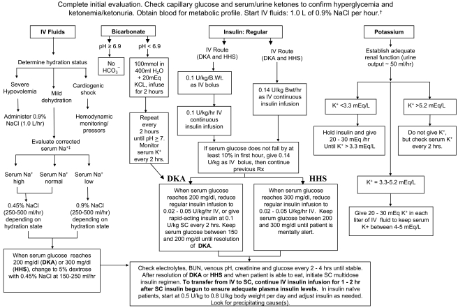

# Diabetic Ketoacidosis (DKA) 

Will Bassett, Matthew Gonzalez

---

## Background

- Classically in type 1 diabetes but can also occur in insulin-dependent type 2 diabetes

- Definition: ↑ blood glucose (typically >350) w/ high anion gap and ketones in blood/urine

- If glucose is significantly elevated but little to no ketones/anion gap present, you likely have HHS, which is typically associated with ↑ serum osm and BG > 600

## Evaluation

- Labs: BMP with anion gap (AG), CBC, phos, blood gas, serum osms, UA, consider beta-hydroxybutyrate

- Workup aimed at discovering the underlying cause (The "I’s"):

    - Infection/ Inflammation: CBC, CXR, UA/UCx, LFTs; consider BCx, lipase (pancreatitis). Note: Leukocytosis will be present in DKA, even if infection isn’t the precipitating factor

    - Ischemia (MI, CVA, mesenteric ischemia): EKG, Troponin, CT(A) if clinical suspicion

    - Intoxication - Ethanol (can cause ketosis with or without acidosis), cocaine, MDMA

    - Impregnation - Beta HCG if appropriate

    - Insulin-openia/Iatrogenic: steroids, SGLT2 inhibitors, other meds, insulin delivery failure (pump failure, insulin degraded by heat, etc.)

Remember to correct sodium for hyperglycemia (Na + 2.4 mEq * (BG-100))

## Management

- Initial monitoring: q2-4h BMPs (monitor K closely), q1h BG fingersticks

    - Can space less frequently once gap is closed x 2 and patient off insulin infusion

- Ensure IV access

- Start IV fluids, insulin, and potassium as below

    - Start insulin gtt

    - Start subcutaneous long-acting insulin as soon as insulin drip/IV insulin is started

        - Either start home long-acting (dose reduce as needed) or if insulin naïve, lantus 0.2-0.3u/kg/day

    - Lactated ringers’ preferred fluid if no contraindication

    - Dextrose should be added when BG <200 (or clear liquid diet)

    - Turn off insulin drip when anion gap is closed on two consecutive BMPs. Make sure your long acting insulin has been given at least four hours prior to drip being turned off

- Consult endocrinology early

- Management algorithm below (Diabetes Care. 2009 Jul; 32(7): 1335–1343)

- Note: pts are usually deficient in total body potassium even if their serum potassium is high

## Additional Information

- Pts on insulin drip can be admitted to stepdown (8MCE) with order set

- Pts can be admitted to stepdown on a subcutaneous insulin protocol with mild DKA with endocrinology guiding insulin management

- Avoid ordering C-peptide if concern for new type 1 diabetes, beta islet cells can be "stunned" with recent hyperglycemic states and may be falsely low

- SGLT2 inhibitors are being prescribed much more often and can cause a euglycemic DKA, where acidosis and ketosis present but no elevated BG. These patients still require an insulin gtt until their acidosis has improved and their gap closed, regardless of BG level

---

