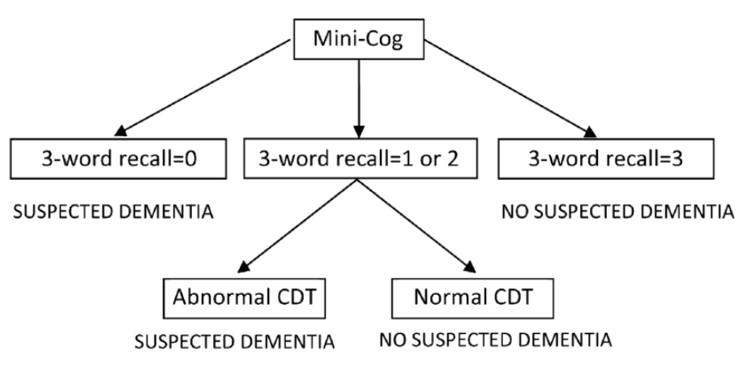

# Dementia

Thomas Horton

---

## Background

- **Alzheimer’s Disease (AD)**: short-term memory deficits prominent
- **Vascular Dementia**: “Stepwise decline” in memory and functional
    status
- **Lewy Body Dementia**: hallucinations, memory difficulties with
    atypical Parkinsonism early
- **Frontotemporal Dementia**: behavioral (aggressive or
    disinhibited), language (primary progressive aphasias) or memory
    (Alzheimer’s/FTD overlap) variants
- **Posterior Cortical Atrophy**: visual difficulties and ocular
    apraxia preceding memory problems
- **Creutzfeldt-Jakob Disease (CJD)**: manifests with subacute
    cognitive decline, seizures, vision loss, personality changes. Can
    develop startle myoclonus
- **Corticobasal degeneration**: focal neurologic changes with
    parkinsonism
- **Neurosyphilis**: rare, but treatable, present with a range of
    cognitive changes. Develop meningovascular encephalitis. Pts can
    develop an arteritis, headache, and hydrocephalus.
- **Normal Pressure Hydrocephalus (NPH)**: “wet, wacky and wobbly”
    meaning incontinence, gait apraxia and cognitive changes (usually
    frontal symptoms)
- **Autoimmune Dementias**: includes limbic encephalitis (like NMDA)
    where there are memory and personality changes, autonomic changes,
    hallucinations, and seizures

<table style="width:100%;">
<colgroup>
<col style="width: 27%" />
<col style="width: 27%" />
<col style="width: 44%" />
</colgroup>
<thead>
<tr class="header">
<th>Normal Aging</th>
<th>Mild Cognitive Impairment</th>
<th>
Alzheimer’s Dementia

(DSM V Diagnostic Crit.)
</th>
</tr>
</thead>
<tbody>
<tr class="odd">
<td>
Mild decline in working memory

More effort/time needed to recall new info

New learning slowed but well compensated by lists, calendars,
etc.

+

No impairment in social &amp; occupation functioning
</td>
<td>
Subjective complaint of cognitive decline in at least one
domain

+

Cognitive decline is noticeable and measurable

+

No impairment in social &amp; occupation functioning
</td>
<td>
Evidence of significant cognitive decline from a <em>previous
level of performance in one or more cognitive domains</em>

+

Causes significant impairment in social &amp; occupation
functioning

+

Other medical &amp; psychiatric conditions, including delirium, have
been excluded

+

Insidious onset and gradual progression of impairment in at least two
cognitive domains
</td>
</tr>
<tr class="even">
<td colspan="3"><strong>Cognitive domains</strong><em>:</em>
learning/memory, language, executive function, complex attention,
perceptual motor, social cognition</td>
</tr>
</tbody>
</table>

<table>
<colgroup>
<col style="width: 16%" />
<col style="width: 17%" />
<col style="width: 18%" />
<col style="width: 19%" />
<col style="width: 27%" />
</colgroup>
<thead>
<tr class="header">
<th></th>
<th>Alzheimer’s Disease</th>
<th>Vascular Dementia</th>
<th>Lewy Body Dementia</th>
<th>Frontotemporal Dementia</th>
</tr>
</thead>
<tbody>
<tr class="odd">
<td><strong>Onset</strong></td>
<td>Gradual</td>
<td>Sudden or stepwise</td>
<td>Gradual</td>
<td>Gradual (age &lt; 60)</td>
</tr>
<tr class="even">
<td><strong>Cognitive Domains &amp; Symptoms</strong></td>
<td>Memory, language, visuospatial</td>
<td>Depends on location of ischemia</td>
<td>Memory, visuospatial</td>
<td>Executive dysfunction, personality changes, disinhibition, language,
+/- memory</td>
</tr>
<tr class="odd">
<td><strong>Motor Symptoms</strong></td>
<td>
Rare early

Apraxia later
</td>
<td>Correlates with ischemia</td>
<td>Parkinsonism</td>
<td>None</td>
</tr>
<tr class="even">
<td><strong>Progression</strong></td>
<td>Gradual (over 8-10 years)</td>
<td>Gradual or stepwise with further ischemia</td>
<td>Gradual, but faster than Alzheimer’s disease</td>
<td>Gradual, but faster than Alzheimer’s disease</td>
</tr>
<tr class="odd">
<td><strong>Imaging</strong></td>
<td>Possible global atrophy</td>
<td>Cortical or subcortical on MRI</td>
<td>Possible global atrophy</td>
<td>Atrophy in frontal &amp; temporal lobes</td>
</tr>
</tbody>
</table>

## Evaluation

- MINI-COG: Screening test for cognitive impairment (highly sensitive)
    - Ask pt to remember three words (banana, sunrise, chair). Ask pt to
    repeat immediately
    - Ask pt to draw clock. After numbers are on the face, ask pt to “set
    hands to 10 past 11”
        - Correct is all numbers in right position AND hands pointing to
        the 11 and the 2
- Ask pt to recall the three words

<figure markdown>

<figcaption markdown>MINI-COG Flowchart</figcaption>
</figure>

- MOCA: Montreal Cognitive Assessment
    - Lengthier test of cognition (but highly specific for cognitive
    impairment)
    - Useful for detecting subtle deficits as in Mild Cognitive Impairment
    (MCI)
    - Scores:
        - 18-25: Mild cognitive impairment
        - 10-17: Moderate cognitive impairment
        - <10: Severe cognitive impairment

- Rule out reversible causes of dementia-like symptoms: **DEMENTIA**
    - Drugs
    - Emotional (depression)
    - Metabolic (CHF, COPD, CKD, OSA)
    - Endocrine (hypothyroidism, hyperparathyroidism, hyponatremia)
    - Nutrition (B12 deficiency)
    - Trauma (chronic SDH)
    - Infection
    - Arterial (vascular)
- B12, thyroid studies
- RPR, HIV testing in at-risk patient groups
- Neuropsych testing can be done for more clear patterns of
    dysfunction
- MRI brain with contrast if concerned for inflammatory or infectious
    causes
    - CJD: cortical ribboning on DWI with T2 hyperintensity in the
    thalamus and basal ganglia
    - Sulcal crowding and bowing of the corpus callosum can be seen in NPH
    on imaging

## Management

- Targeting Cognitive Impairment
    - Cholinesterase Inhibitors: Donepezil, rivastigmine
        - Indicated for any stage (except FTD)
        - SE: GI (nausea, diarrhea), bradycardia, orthostasis
    - NMDA antagonists: Memantine
        - Indicated in moderate to severe AD in combination with
            cholinesterase inhibitors
        - Fewer SE than cholinergic medications
- Vitamin supplementation (i.e. Vitamin E)
    - Unclear benefit in delaying progression of dementia
- Targeting Behaviors
    - Non-pharmacologic management has the best evidence of effectiveness
    - Depression: Treat with antidepressants (SSRI’s)
    - Sleep Disturbance: Mirtazapine (7.5 mg nightly) or Trazodone (25 mg
        nightly)
    - Agitation: Try SSRI (citalopram, sertraline)
        - Consider antipsychotics (black box warning increased risk of
            death in elderly)
