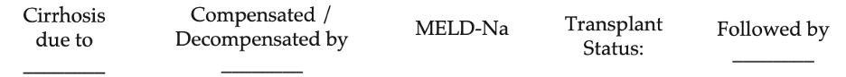

# Cirrhosis Overview  

Ahmad Yanis

---

## Background

- Standard 1-liner for any patient with cirrhosis:

 
- Example 1-liner: 65yo M with cirrhosis due to HCV decompensated by ascites and HE (MELD 25) who is listed for transplant and followed by Dr. Izzy
    
- Etiology of cirrhosis: HCV>HBV, EtOH, NASH, Wilson’s, hemochromatosis, A1AT deficiency, autoimmune hepatitis, PSC, PBC, congestive hepatopathy (right heart failure), medication- induced

- Complications that cause decompensation: overt ascites (or hepatic hydrothorax), overt hepatic encephalopathy (HE), esophageal variceal hemorrhage (EVH)

- Always calculate daily MELD-Na scores (predicts 3 mo survival based on Tbili, Cr, INR, Na)

## Evaluation

- Goals: establish etiology, evaluate/treat complications, determine prognosis, and consider transplant evaluation

- History:
    - Symptoms suggesting decompensation: confusion, sleep disturbances, abdominal swelling, lower extremity edema, scleral icterus/jaundice, pruritus, easy bruising/bleeding (skin, mouth, GI tract), dyspnea
    - Social history: EtOH and drug use hx, date of last drink, average # of drinks/day, duration of EtOH use, prior rehab, hx of DUI, if there has been continued EtOH use despite knowledge of liver disease; these factors all impact transplant candidacy
    - Ascites: compliance with diuretics, compliance with salt restriction, frequency of paracentesis (volume removed, date of last para), h/o SBP, hx of TIPs
    - HE: compliance with lactulose, # of BMs per day, any potential triggers (see HE section)
    - GIB/EVH: hematemesis, coffee ground emesis, melena, hematochezia (duration, volume, # of bleeding episodes), last EGD (varices, banding) and colonoscopy, compliance with non-selective BBs

- Physical exam: asterixis, ascites, edema/anasarca, splenomegaly, muscle wasting, gynecomastia, testicular atrophy, palmar erythema, spider angiomata, scleral icterus/jaundice, petechiae/ecchymoses, caput medusa, Terry’s nails

- Labs

    - Initial Workup: CMP, CBC, Coags, UA, HCV/HBV, Fe studies, PEth
    - Unless requested by hepatology, defer to outpatient: AFP, ANA, IgG, A1AT,
ceruloplasmin, AMA (PBC), ASMA (AIH), anti-SLA (AIH), anti-LKM (AIH)

- Imaging:
    - Abdominal US with duplex unless done in past 6 months or indication for repeating sooner (concern for new portal vein thrombosis)
    - For transplant eval, needs triple phase CT A/P (contrasted study, arterial and venous phases) or MRI abdomen with contrast

- Liver biopsy: gold standard for cirrhosis diagnosis but is not always needed if clinical presentation, labs, and imaging consistent with cirrhosis

## Lab abnormalities

- Hyponatremia (see hyponatremia section below)

- Cirrhotic coagulopathy (increased INR): due to ↓ coagulation factor production

- Thrombocytopenia: due to splenic sequestration, ↓ TPO production

- Hypoalbuminemia: indications for 25% albumin transfusion – SBP (1.5g/kg on day 1, 1g/kg on day 3), LVP (6-8g/L of ascites), HRS (albumin challenge: 1g/kg/day with max 100 g/day x 2 days), hypoNa <125 and refractory to fluid restriction

## Management

- Nutrition: high protein diet, 2g Na restriction (if ascites present)
    - Consider MVI, folate, thiamine (particularly in pts with EtOH use disorder)
    - Mediterranean diet for NASH
    - Fluid restriction if hyponatremic

- Immunizations: ensure UTD with HBV/HAV, PPSV23, Prevnar, Flu, COVID-19 vaccines

- Consider consulting Addiction Psych and Social Work for pts with EtOH use disorder - can assist with arranging Intensive Outpatient Program (IOP), Alcoholics Anonymous (AA)

- General screenings include: HCC screening (q6 months), EVH screening (see section below), monitor for other decompensations and treat accordingly, monitor MELD and consider transplant evaluation when >15

- Refer to hepatology outpatient

## Medication Tips:

- Pain: 2g limit Tylenol, No NSAIDs, limit sedating medications especially with HE.
    - Tramadol 25-50mg generally safe to use

- Pruritus: Sarna lotion, can spot dose antihistamines. Can discuss with pharmacist/attending about starting sertraline, cholestyramine (interacts with many medications), or rifampin.

- Anxiety/insomnia: hydroxyzine, avoid benzodiazepines

- If needed for EtOH withdrawal, use lorazepam (Ativan) instead of chlordiazepoxide (Librium) or diazepam (Valium) due to its shorter half life
