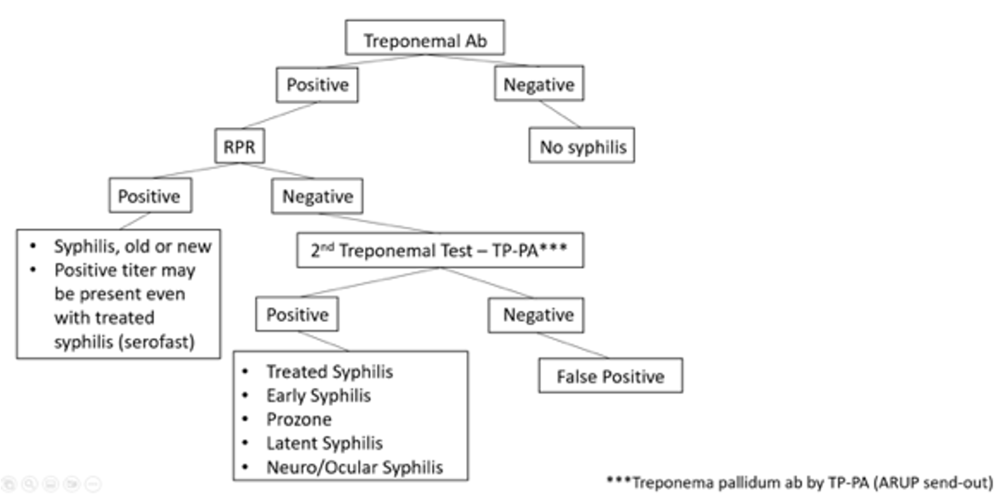

# Sexually Transmitted Infections 

Lauren Waskowicz

--- 

## Evaluation: Gonorrhea, Chlamydia, Trichomonas 
-	Microbial diagnosis is preferred, rather than clinical diagnosis alone 
-	Test of choice: NAAT of the first-catch urine in men; NAAT of vaginal swab in women 
-	NAAT of pharyngeal or rectal swab should also be performed in patients with reported symptoms, recent sexual exposure, and location of sexual activity. Note this is also routine testing in patients on PrEP. 
-	Routine screening should be offered to sexually active patients, as many are asymptomatic
    -	Women age < 25 years should undergo annual screening for G/C
    -	MSW without HIV infection should undergo screening for G/C if at increased risk
    -	MSM without HIV infection should undergo annual screening for G/C 
-	NAATs can detect both LGV and non-LGV chlamydia, but cannot distinguish between them 
-	ALWAYS Check CDC guidelines to confirm treatment strategy given emerging resistance: https://www.cdc.gov/std/treatment-guidelines/default.htm 

## Chlamydia

### Background 
-	Cause: gram negative bacteria Chlamydia trachomatis  
-	Most individuals are asymptomatic though spectrum of dx: urethritis, cervicitis PID, conjunctivitis, perihepatitis (Fitz-Hugh-Curtis syndrome), pneumonia, proctitis, epididymitis, reactive arthritis, pharyngitis, lymphogranuloma venereum (LGV), endemic trachoma 
-	Differential diagnosis: Neisseria gonorrhoeae, Trichomonas vaginalis, Mycoplasma genitalium 

### Management: 
-	Doxycycline 100mg BID x 7 days
    -	Alternative treatment options (for allergies/severe contraindications): azithromycin (1g PO x 1), levofloxacin (500mg PO daily x7 days), and ofloxacin (300mg BID PO x7 days) 
-	Pts who have receptive anal intercourse with positive rectal chlamydia NAAT should receive empiric LGV therapy with doxycycline 100mg BID for 21 days rather than 7. 
-	Pts with recent potential or confirmed exposure within the last 1-2 weeks should be treated empirically 
-	Pts with persistent symptoms, confirmed infection, and who already underwent appropriate treatment, likely have a re-infection, rather than treatment failure. Test again.  
-	Empiric therapy for gonorrhea should be given to pts unless NAAT is negative 
-	Instruct patient to abstain from sexual contact until treatment course completed, test of cure not generally warranted
-	Partners should undergo screening and treatment. Expedited partner therapy (giving pt script for their partner(s)) IS legal in TN and can be used when the partner is unlikely to seek medical care.   

## Gonorrhea

## Background 
-	Gram-negative coccus Neisseria gonorrhoeae 
-	Spectrum of disease: urethritis, cervicitis, epididymitis, proctitis, pharyngeal infections, conjunctivitis, PID, and disseminated gonococcal infection 

## Management 
-	CTX is the only current abx that meets the strict treatment efficacy goals with single-dose therapy.
    -	High dose IM ceftriaxone (<150kg: 500mg IM; >150kg: 1g IM)
        -	Same for pharyngitis or conjunctivitis
    -	CTX allergies: Azithromycin (2g PO x1) + Gentamicin (240mg IM x1) or Gemifloxacin. Would discuss with ID. 
-	Treatment of chlamydia must also be accompanied with gonorrhea treatment when it has not been excluded with molecular testing.
    -	Doxycycline 100mg BID for 7 days 
-	Pts who have persistent symptoms despite tx should be suspected of having resistant gonorrhea or Mycoplasma genitalium. Test with culture and antimicrobial susceptibility testing (with or without NAAT). 
-	Partners should undergo screening and treatment. Expedited Partner Therapy is NOT legal for gonorrhea treatment in TN.
-	Instruct patient to abstain from sexual contact for 7 days following treatment, test of cure not generally unnecessary though most providers would re-screen after six months to check for re-Infection after resolution of symptoms. 

## Trichomonas

### Background
-	Flagellated protozoan Trichomonas vaginalis 
-	Most individuals are asymptomatic, although there is a spectrum of disease: urethritis or cystitis, vaginitis, cervicitis, pelvic inflammatory disease
-	Most common non-viral sexually transmitted infection worldwide

### Management
-	Female: Metronidazole 500 mg BID for 7 days
-	Male: Single dose of 2g of Metronidazole (Four 500 mg tablets) 
-	Due to high rates of co-infection with other STI’s patients should undergo a full screening panel if Trichomonas is confirmed
-	Partners should undergo screening and treatment. Expedited Partner Therapy is NOT legal for Trichomonas treatment in TN.
-	Instruct patient to abstain from sexual contact until they and their sexual partner have completed treatment and are asymptomatic. Women should undergo retesting within 3 weeks to 3 months to ensure cure

## Syphilis

### Background 
-	Caused by the spirochete, Treponema pallidum 
-	High rate of HIV co-infection among MSM with syphilis (~42%) 
-	Transmitted by direct contact with an infectious lesion during sex (condoms do NOT provide full protection) 
-	Can readily cross the placenta  

### Evaluation 
-	Test all pts with signs and symptoms, as well as pts who are at increased risk for acquiring infection (pts with sexual partner with early syphilis, MSM, HIV, high risk sexual behaviors, and history of commercial sex work or incarceration) 
-	HIV testing should be offered to all pts who test positive  
-	Pregnant pts should be screened for syphilis  
-	There are two types of serologic tests: treponemal-specific tests (FTA-ABS, MHA-TP, TPPA, TP-EIA, CIA) and nontreponemal tests (RPR, VDRL, TRUST). VUMC utilizes Reverse Sequence Algorithm due to high number of false negatives in traditional algorithm (see diagram below for testing strategy)
    -	Treponemal tests typically remain positive for life following infection
    -	Nontreponemal quantifies amount of antibody present and can be used to detect titers to assess for treatment. Titers should decline after a pt has been treated. A rise in titers (4 fold) in a previously treated pt should be concerning for new infection.  
-	Requires a humoral response, so can be false negatives if immunocompromised 
-	False positives: autoimmune diseases, pregnancy, other infections 
-	Neurosyphilis can occur at any time after infection. All newly diagnosed pts with syphilis should have a full neurologic exam and if any abnormalities should have an LP sent for CSF-VDRL (specific, but not as sensitive) with reflex to FTA-ABS (sensitive, but not as specific) 
-	Any pts with syphilis and vision changes should get an ophthalmology evaluation for fundoscopic exam.  

<table border="1">
  <tr>
    <th></th>
    <th>+Treponemal</th>
    <th>-Treponemal</th>
  </tr>
  <tr>
    <td>+Non-treponemal</td>
    <td>Diagnostic of syphilis (completely new or potentially re-infected)</td>
    <td>Likely false positive</td>
  </tr>
  <tr>
    <td>-Non-treponemal</td>
    <td>Likely history of successfully treated syphilis</td>
    <td>Likely not syphilis or false negative (due to prozone effect*)</td>
  </tr>
  <tr><td colspan='3'>*Prozone effect: when there is an overabundance of antibodies and they interfere with clumping/formation of antigen/antibody complex so agglutination cannot be visualized</td></tr>
</table>

### Management 
-	When positive Treponemal Ab + low positive or negative RPR, it is important to determine prior testing and treatment.
    -	For obtaining historical syphilis titers and past treatment records, email syphilis.history@tn.gov with responses to be expected same day or next business day 
-	To assess treatment efficacy, goal of a fourfold decrease in titer after treatment 

<table border="1">
  <tr>
    <th></th>
    <th>Symptoms</th>
    <th>Treatment</th>
    <th>Treatment Alternatives</th>
  </tr>
  <tr>
    <td>Primary</td>
    <td>Painless (but can be painful) chancre at inoculation site with regional lymphadenopathy</td>
    <td rowspan='3'>PCN G benzathine 2.4 million units IM x1</td>
    <td rowspan='3'>Doxycycline 100mg PO BID x 14 days OR Ceftriaxone 1-2g daily IM or IV x 10-14 days OR Tetracycline 500mg PO QID x 14 days OR Amoxicillin 3g BID and probenecid 500mg BID x 14 days</td>
  </tr>
  <tr>
    <td>Secondary</td>
    <td>Systemic illness with rash (palms, soles), fever, malaise, alopecia, hepatitis, mucous patches, condyloma, pharyngitis</td>
  </tr>
  <tr>
    <td>Early Latent</td>
    <td>Infected, but no symptoms. Occurs within one year of initial infection.</td>

  </tr>
  <tr>
    <td>Tertiary</td>
    <td>Symptomatic late syphilis (CV system, gummatous dx)</td>
    <td rowspan='2'>PCN G benzathine 2.4 million units IM weekly x3 weeks</td>
    <td rowspan='2'>Doxycycline 100mg PO BID x 4 weeks OR Ceftriaxone 2g daily IM or IV x 10-14 days</td>
  </tr>
  <tr>
    <td>Late Latent  Syphilis of Unknown Duration</td>
    <td>Infected, but no symptoms. Occurs >1 year after initial infection. Refer to last known negative test. Date of infection unknown</td>
  </tr>
  <tr>
    <td>Neurosyphilis</td>
    <td>Can occur at any time. Early: asymptomatic or symptomatic meningitis, vision loss, hearing loss. Late: brain and spinal cord manifestations (dementia, tabes dorsalis)</td>
    <td>Aqueous PCN G 4 million units IV q4h x 10-14 days</td>
    <td>PCN G procaine 2.4 million units IM daily and probenecid 500mg PO QID x 10-14 days  If PCN allergic, desensitize  Ceftriaxone 2g daily IM or IV x 10-14 days</td>
  </tr>
</table>
