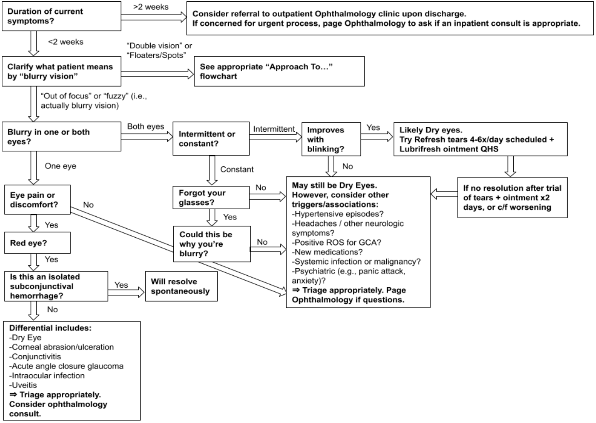

# Approach to Blurry Vision

Jonathan A. Barnett

---

<figure markdown>

<figcaption markdown>Approach to Blurry Vision Flowchart</figcaption>
</figure>

## Key Points

- This flowchart is meant to serve as a guide. Bear in mind that there
    are always exceptions.
- Many ocular problems are not urgent and can be dealt with
    outpatient. Assessing the acuity of onset is the first step.
- In general, the top differential for blurry vision is Dry Eye,
    Cataract, or Uncorrected refractive error.
- If the symptoms are acute and just in one eye, it is more likely to
    be ocular and warrants further investigation (likely ophthalmology
    consult).
