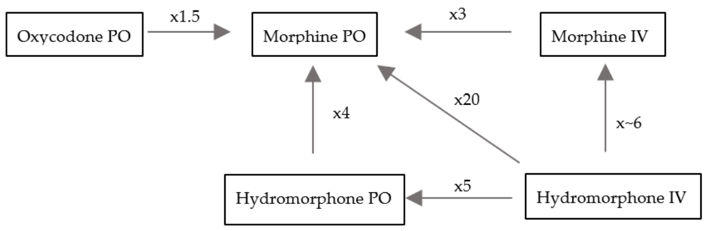

# Opioids: General Principles & Conversion

Eli Cohen

---

## Oral Morphine Equivalent (OME) Conversion Table:

| Drug                                                                                 | PO    | IV    | APAP      | IR                 | ER          | Notes                |
|--------------------------------------------------------------------------------------|-------|-------|-----------|--------------------|-------------|----------------------|
| Tramadol                                                                             | 0.1x  | -     | -         | Tramadol           | Ultram ER™  | NSAID properties     |
| Morphine                                                                             | 1x    | 3x    | -         | Morphine IR        | MS-Contin™  | Renally cleared      |
| Hydrocodone                                                                          | 1x    | NA    | Lortab    | Hydrocodone        | NA          |                      |
| Oxycodone                                                                            | 1.5x  | -     | Percocet  | Roxicodone™        | Oxycontin™  |                      |
| Hydromorphone                                                                        | 4x    | 20x   | -         | IV, Oral           | -           | Oral is $            |
| Fentanyl                                                                             | 300x  | 300x  | -         | IV’ Buccal, Nasal  | Patch       | Dosed in ug, not mg  |
| *Abbreviations: ER = extended release; IR = immediate release; APAP = acetaminophen* |       |       |           |                    |             |                      |

## Conversion:

- Transition between opiates is done using OME.
    Each drugs’ potency is compared to oral morphine (see
    table). Ex: 1 mg IV morphine = 3 mg PO morphine
- When transitioning, doses are traditionally reduced by 1/4 to 1/3
    due to cross tolerance
- IR/ER regimens: Consider switching to extended release when
    requiring 3-4 doses of intermediate release (IR) medications in a
    24-hour period regularly. The ER medication should treat the chronic
    pain experienced by a patient. The IR preparation is indicated for
    breakthrough pain. The IR dose should be calculated as 10-20% of the
    total OME dose a patient takes daily. Fentanyl patches should last
    72 hours

<figure markdown>

<figcaption markdown>Opiate conversions</figcaption>
</figure>

## Patient Controlled Analgesia (PCAs)

- Pumps can be programmed to deliver a continuous rate and/or a bolus
    dose

    - Basal rate = a continuous infusion dosed per hour that cannot be
        adjusted by the patient

    - Demand dose = a patient-directed bolus that is given at a prescribed
        frequency whenever the pt presses the button. Both the dose and
        frequency can be adjusted

    - The general rule of thumb is to calculate the total OME delivered
        through the demand when a pt is in steady state and convert 75% of
        this dose into the total continuous rate.

## Calculating initial doses:

- Basal dose: check what the patient is actually taking at home (may
        be different than what is prescribed, use OME). Take the total daily
        dose and convert to IV and then divide that by 24 hours to get an
        hourly rate. If moderate pain, increase dose by 25-50%; if severe,
        by 50-100%

- Demand doses: The bolus dose should be 10-20% of total daily dose.
        The availability is based on half-life of the medication (2hr for
        IV). Adjust the availability based on how frequently you want
        patient to be able to have a demand dose (ex: if q10min divide by 12
        or if q15min divide by 8 for 2 hours)

- Don’t forget to set lock-outs (maximum dose that can be given over a
        certain period of time) that includes both basal and demand doses

- Remember that the basal rate will not get to steady state for at
        least 8 hrs; When you admit pts or are transitioning pts to a PCA,
        always initiate the PCA pump with a bolus (or loading) dose

## How to Order PCA at VUMC

- Select Analgesic:

    - \*Hydromorphone (most common): Order “Hydromorphone (DILAUDID) PCA”

    - Fentanyl (if on at home; not a good inpatient PCA): Order “Fentanyl
        PCA”

    - \*Morphine: Order “Morphine PCA”

- Select “\[Analgesic\] PCA syringe” and adjust the following to pt
    needs:

    - PCA Dose (“Demand”): amount the patient gets when s/he presses the
        button

    - Lockout Interval: time between which “demand” doses will not be
        administered if s/he presses the button (i.e., the PCA “locks out”)

    - Continuous Dose (“Basal”): amount the pt gets per hr in continuous
        infusion

    - Max Dose: maximum amount of analgesic (Basal + Demand) pt can get in
        24 hours

- Select all “PCA Nursing Orders”

## How to Order PCA at VA

- Under Orders, select “Pain/Sedation Infusions”

- Under “PCAs,” select Analgesic of choice (Hydromorphone or Morphine)

- Adjust the following:

    - Load: amount the pt will receive on initial set up of PCA

    - Basal: amount the pt gets per hour in continuous infusion

    - Demand: amount the pt gets when s/he presses the button

## Interrogating PCA (to determine amount of analgesia pt received):

- Look at IV pump display and hit “Channel Select” on PCA

- Select “Options” in bottom left of IV pump

- Select “Patient History” on the left of the screen. This shows the
        administration history for a certain time period (e.g., 24h, 12h,
        4h, etc.)

- Hit “Zoom” on bottom of screen to change time period to 24 hours. Should show:

    - Total Drug: total amount of drug received in last 24 hours

    - Total Demands: amount of times the pt has pushed the button for
        demand dose

    - Delivered: amount of times the pt actually received a demand dose

    - The difference between “Total Demands” and “Delivered” is the number
        of times the patient pushed the button without receiving a dose

## Opioid Side effects

- Constipation: dose-dependent and will not develop tolerance. If pt
        has opioids, they need robust bowel regimen (MiraLAX, senna) with
        goal of BM ≥every 3 days

    - For opioid-specific constipation can do SQ RelistorTM
        (methylnaltrexone) but this is expensive and can only be given in
        the PCU or oncology floors at VUMC. For patients with chronic
        opioid-induced constipation as an outpatient can trial oral agents
        like MovantikTM (naloxgeol). Can also consider PO
        naloxone but it does have small amount of bioavailability so watch
        for systemic reversal

- Nausea: occurs with opiate naïve pts. Consider starting an
    anti-emetic concurrently. Most pts will develop tachyphylaxis with
    this over a day, so the antiemetic can be discontinued

- Urinary retention: Consider role of opioids in pts with new-onset or
    worsening urinary retention. Try to de-escalate opioid dosing if
    possible

- Overdose: In pts with apneic emergency, IV 0.4 mg Naloxone; however,
    low threshold for multiple doses until response. For pts prescribed
    opioids as outpatient, need naloxone 4 mg intranasal

    - If a patient with chronic opiate dependence is over sedated but not
        in immediate danger of respiratory failure, one can 1) hold the dose
        of opioid and let them wake up on their own or 2) give a dose of
        naloxone 0.02-0.04mg (1/10 of the usual dose). This latter strategy
        prevents opioid withdrawal and precipitation of pain crisis in
        patients on chronic opioids

- Pruritis: due to histamine release from mast cells; can be treated
    with antihistamines. The opioid can also be rotated. Some but not
    all pts will develop tachyphylaxis to this symptom

- Toxicity: hyperalgesia and neuroexcitatory effects (AMS, myoclonic
    jerking, seizures). Risk factors for neuroexcitatory effects are
    rapid titration, dehydration, and/or renal failure. Treatment is to
    rotate to a higher potency opioid and hydrate when possible
