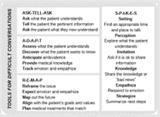

# Video Examples for Navigating Difficult Conversations

Mohana Karlekar

---

Navigating difficult conversations with pts can be daunting especially if you have never seen someone do one well before.  Conversations should follow a logical and sequential approach. much like any procedure we perform in medicine.  Like all procedures, practice makes us better

Scan the QR Code to View Video Examples or Search The Learning Exchange “Navigating Difficult Conversations With Pts

Good communicators have both formulated their message and identified which communication strategy to use before they initiate a conversation.
Here are some suggestions for “Navigating Difficult Conversations”
- Step 1. Determine your message—keep it simple and short
- Step 2. Identify what type of news you are communicating: breaking bad news, assessing understanding of information, communicating prognosis, or navigating goals of care
- Step 3. Pick the video that best suits your purpose  

