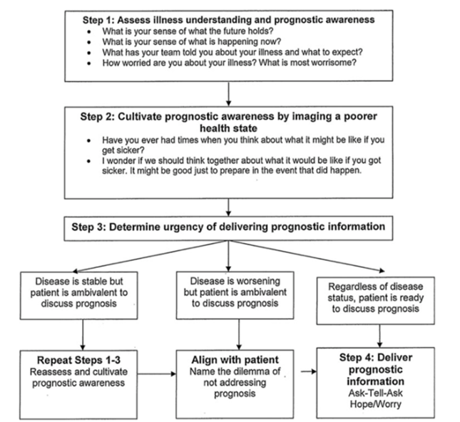

# Prognosis

Liana Mosley

---

## Background
-	Prognosis is estimating the likelihood of an outcome (morbidity, mortality) due to a medical condition and can help guide clinicians, pts, and families in medical decision making.
-	Pts frequently cite life choices rather than medical decisions for wanting to know prognosis.

## Estimating prognosis
-	Tools
    -	Should be specific to each pt’s situation (type of cancer, transplant eligibility, co-morbidities, etc.)
    -	Non-disease specific tool: https://eprognosis.ucsf.edu/
-	Errors
    -	Studies suggest that clinicians consistently overestimate survival
    -	Two factors most associated with clinician error
        -	More clinical experience correlates with less prognostic error
        -	Longer duration of pt-clinician relationship correlates with more prognostic error

## When to discuss prognosis
-	Several studies suggest that across age and cultural background, most pts want their physicians to discuss prognostic information with them
-	Ideally clinicians should discuss when the pt is not acutely decompensating and can process information
-	Earlier prognostic discussions have been shown to decrease rates of hospitalization and highly aggressive care (chemotherapy, pressors) in terminally ill cancer pts

## How to discuss prognosis
-	Common Four-Step approach
    -	Confirm that the pt/family are ready to hear prognostic information
    -	Present information using a range: a few days to weeks; 2-4 months
    -	Allow silence after you provide information; respond to emotion
    -	Use prognostic information for eliciting end-of-life goals
-	Ask-tell-ask
    -	Ask the pt what type of information would be most useful for them
    -	Provide information
    -	Ask pt if that answers their question or if they have additional ones
-	Pairing hope and worry:
    -	“While I hope that x might happen, I worry that y is a possibility.”

## Other:
-	Helpful phrasing for pts and families resistant to discussing prognosis
    -	“In order to make this decision, it would be helpful if we talked about how much time you might have left to live. What are your thoughts on discussing this information?”
    -	“If you knew time was short for you, what would be important to you in making this decision?”
-	The Palliative Care Network of Wisconsin has several helpful “Fast Facts” on determining/ communicating prognosis for specific disease states:
    -	https://www.mypcnow.org/fast-fact/prognosis-after-stroke/
    -	https://www.mypcnow.org/fast-fact/prognosis-of-anoxic-ischemic-encephalopathy/
    -	https://www.mypcnow.org/fast-fact/prognosis-in-hiv-and-aids/
    -	https://www.mypcnow.org/fast-fact/prognosis-in-decompensated-liver-failure/
    -	https://www.mypcnow.org/fast-fact/prognosis-in-end-stage-copd/
    -	https://www.mypcnow.org/fast-fact/determining-prognosis-in-advanced-cancer/

## Cultivation of prognostic awareness:

 
