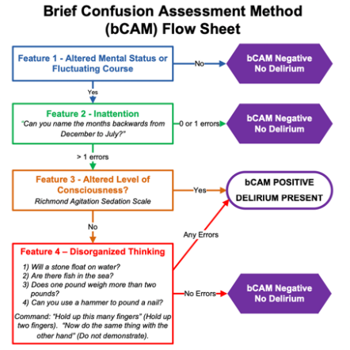

# Delirium 

Ben Johnson, reviewed by Jonathan Smith and Daniel Daunis

---

## Background

- Definition: acute (hours to days) fluctuating disturbance of attention and awareness due to an underlying medical condition

- Complex and multifactorial condition, often due to underlying condition, with unknown pathophysiological mechanisms
  
- Increased morbidity, mortality, and functional decline

- Presentation: deficits in attention, orientation, or memory; hallucinations or delusions; sleep-wake disturbances; psychomotor changes (hyperactive, hypoactive, or mixed); language impairment; anxious or depressed mood, and/or emotional lability (agitation)

    - Think about the ABC’s of Delirium

        - Affect (anxiety, paranoia, irritability, apathy, mood shifts, personality changes)

        - Behavior (hallucinations, restlessness or agitation, psychomotor abnormalities, sleep disturbances)

        - Cognition (impaired memory, disorientation, disturbances in speech)

- Delirium can persist despite identification and reversal of underlying causes, particularly in older patients or those with baseline cognitive deficits.

## Evaluation

- Use screening tools to assess for delirium: Brief Confusion Assessment Method (bCAM). See critical care section for the ICU version, CAM-ICU

   

- Once delirium is diagnosed, evaluate for the underlying cause.
    Delirium has many etiologies and may occur alone or in combination
    (in \~10% of cases, no clear cause is found)

    - Mnemonic for common causes of delirium:

        - D- Drugs/toxins (use of benzodiazepines, opiates,
            anticholinergics, steroids, etc., withdrawal from ETOH, benzos,
            etc.)

        - E- Eyes/ears (sensory deficits)

        - L- Low perfusion states (MI, PE, heart failure, sepsis)

        - I- Infection

        - R- Retention (urine, stool)

        - I- Intracranial events (trauma, seizure, stroke, hemorrhage)

        - U- Undernutrition/dehydration

        - M- Metabolic, endocrine (Hypo or hyper Na, hyperCa, uremia,
            thyroid, hypoglycemia)

- Workup
  
    - History

        - Review current medications including those recently started or discontinued, as well as drug interactions

        - Review alcohol, sedative, substance use

        - Assess for pain and discomfort

    - Vital signs

        - Temperature, O2 sat, POC glucose, and orthostatic vitals

    - Physical exam

        - Assess for infection (SSTI, UTI, pneumonia, meningitis), abdominal pain, and sensory impairments, FND 

    - Labs

        - CMP 

            - Renal and hepatic function for changes in metabolism/elimination of medications

            - Glucose
             
        - Ammonia

        - Serum medication levels

        - Magnesium 

        - TSH and free thyroxine 

        - Infection – U/A, CXR, blood, urine, and sputum cultures 

        - CBC

        - B12, folate, vit D

    - Imaging

        - CTH – non-contrast unless unable to get MRI (stroke, large structural changes)

        - MRIb with contrast (stroke, infection, inflammation, more subtle structural changes)

    - Medications - review anticholinergics, sedatives, opioids 

        - Are changes needed to address pain control, constipation, insomnia, nausea, etc?

        - Substance use – evaluate for EtOH or BZD withdrawal state

            - Empirically load on thiamine (500mg IV tid x9 doses)

    - EEG – evaluate for seizures, confirm presence of encephalopathic changes 

    - LP – if concerned for CNS infection, inflammatory condition 

## Management

- Treat underlying cause as above

- Cognitive impairment or dieorientation

    - Provide clock, calendar, and appropriate lighting

- Regular reorientation

    - Provide cues from a familiar environment (pictures, calls or visits from family members)

- Ensure hearing aids, glasses, and dentures are available

- Maintain normal sleep-wake cycle

    - Keep lights on in the day and avoid excessive naps

- Early PT, OT interventions, mobilization, move to bedside chair when able

- Remove medical support devices as able (foley catheters, restraints, telemetry)

- Ensure adequate bowel regimen and hydration

- Assess for pain and treat appropriately

- Medication reconciliation to reduce or eliminate total anticholinergic load, and to reduce or eliminate other deliriogenic medications as able

    - See Beers criteria

- See critical care section for prevention in the ICU (ABCDEF bundle)

- Note on pharmacologic management: There is no pharmacologic intervention known to prevent or treat delirium. Medications for agitation only treat certain behavioral symptoms of delirium, are typically ineffective/harmful for hypoactive delirium, and do not modify the underlying pathological process. Reserve medications for agitation impairing patient safety when non-pharmacologic interventions alone are unsuccessful. See agitation section for medication approach
