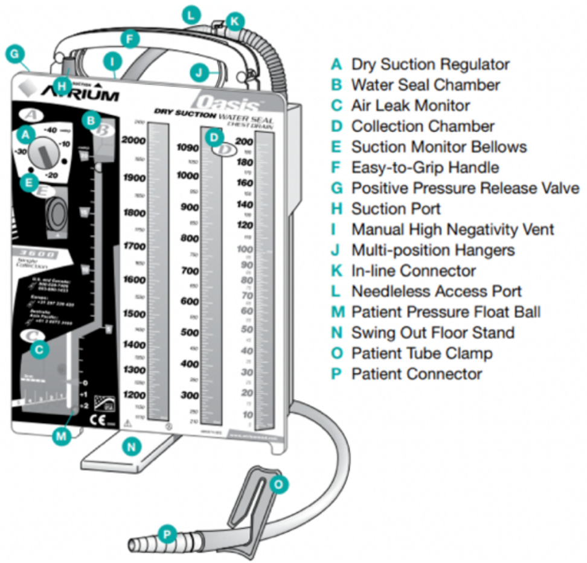

# Chest Tubes

Pakinam Mekki

---

## Background

- Nomenclature: Small bore chest tubes= Pigtail Catheters (Often 8-12
    Fr) placed via Seldinger technique. “Chest Tube” technically denotes
    a large bore, surgical thoracostomy tube (Often 24-40 Fr)
- Indications: Pneumothorax, hemothorax (more often surgical chest
    tubes), empyema, malignant effusion (patient specific), chylothorax,
    penetrating chest trauma
- Contraindications: No absolute contraindications. Relative
    contraindications include hepatic hydrothorax, large emphysematous
    blebs, and anticoagulation or coagulopathy

## Procedure

- Consult pulmonology for patients who may need pigtail chest tube
- Placement and Sizing
  - The location and size of the chest tube is related to the pathology
      - Pneumothorax anterior near the apex of the lung in the 2nd
          intercostal space, midaxillary line
      - Fluid (water, pus, blood), posterior near the base of the lung
          (fifth or sixth intercostal space, midaxillary line
      - Hemothorax surgical chest tube is placed to prevent clot
          formation
- Potential complications: Laceration of an intercostal vessel, organ
    perforation (lung, heart, diaphragm, intraabdominal), trauma of the
    intercostal neurovascular bundle, subcutaneous emphysema,
    pneumothorax, infection, re-expansion pulmonary edema.
  - Smaller size results in less tissue disruption but more likely to
      clog or kink

## Understanding the Atrium

After the chest tube is placed,
it is connected to the Atrium
which can be connected to the wall for suction.
(See Diagram below)

<figure markdown>

<figcaption markdown>Atrium Diagram</figcaption>
</figure>

- (A) Dry suction control - determines the level of suction out of
the chest tube and is set by the provider. It is important to note that
while the atrium is linked to the wall suction via suction port (F) the
level of wall suction is determined by (A)
- (B) Water seal chamber - if the atrium is disconnected from the
wall suction, it is on “water seal” (i.e., to gravity). This allows for
the one-way flow of pleural space contents out of the chest.
- (C) Air leak monitor - if air bubbles are present in the water
seal chamber, then that indicates the presence of air in the pleural
space. The presence of air is different from normal “tidaling,” within
the water seal and requires troubleshooting (see below). Tidaling is
normal; it is the movement with respiratory variation in water seal
chamber. The water should rise with inspiration and fall with
expiration.
- (D) Collection chamber - drains the pleural fluid contents via the
chest tube.
- (E) Suction verification window - will be orange if suction is on
and atrium is functioning appropriately

## Troubleshooting

- Air leaks: If bubbles are present in the water seal chamber, this
    indicates air in the pleural space. This is an expected finding in a
    pneumothorax; over time, the air leak should disappear as the lung
    re-expands. This contrasts with normal tidaling present with
    respiratory variation
  - There are two major causes of air leaks:
      - Persistent air in the pleural space, seen in alveolar-pleural
          fistula or pneumothorax (new or old)
      - Leak in the chest tubing at its insertion site or in the tubing
          system. To identify the etiology of a new air leak, try clamping
          the chest tube at various points, obtain a CXR
- Clogging: Would see debris in the collection chamber and lack of
    tidaling in the water seal camber
  - In patients with viscous fluid output (ex- empyema), important to
      flush the chest tube with normal saline flushes at least twice daily
      to prevent clogging
  - For clog - try flushing 10cc of sterile saline toward the pt or
      “stripping” the chest tube by pressing the chest tube with your
      fingers and pulling towards the drainage system.
  - May require tPA or dornase for fibrinolysis, discuss with team that
      placed the tube

## Chest tube removal

- Generally, chest tubes are removed when there is \< 150cc of
    drainage in 24 hrs (if placed for pleural effusion)
- For pneumothorax, there is typically a step-wise approach to
    removal. The team that placed the chest tube will guide removal
  - Suctionwater seal +/- clamp trial. CXR obtain after each transition
      to monitor for reaccumulation
- Chest tube should be removed while patient hums (to prevent
    inhalation during removal that could introduce air into pleural
    space). Pigtail catheters have to be “unlocked” prior to removal to
    release the pigtail
