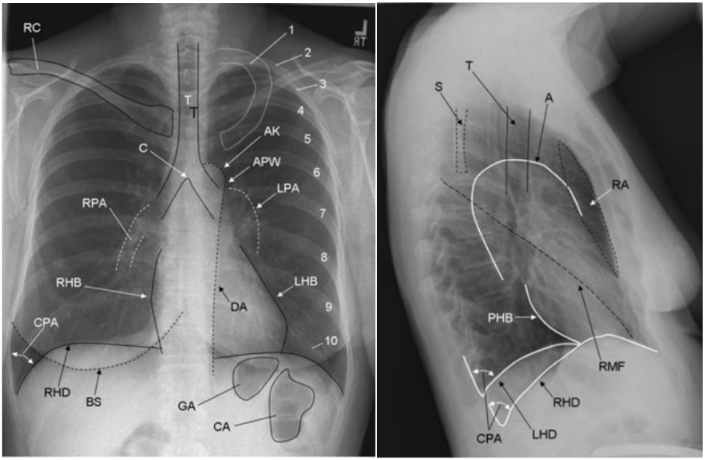

# Basic Chest X-ray Interpretation

Gautam Babu

---

An X-ray is a density-gram where “white” is “dense” and “black” is “not
dense.” Determine a systematic method you use every time you interpret a
CXR to ensure you don’t miss anything

- Start every CXR you interpret by assessing the quality of the film:
- Penetration:
    - Should see vertebral bodies through the cardiac silhouette but
        not into the abdomen
    - If you cannot see them through the heart, the film is
        “under-penetrated,” and everything will appear more “white.”
    - If you can see them through the abdomen the film is
        “over-penetrated” and everything will appear more “black.”
- Rotation: Spinous processes should be in the middle of the
    clavicular heads
- Two Different Systematic Methods:
- ABCDE method
    - Airway – Trachea midline and patent
    - Bones – Bone density and obvious fractures
    - Cardiac Silhouette – Should see L & R heart border, if not there
        may be an adjacent opacity (Right Middle Lobe, Lingula)
        - Cardiomegaly = heart size ≥ 1/2 the width of the hemithorax
            on a PA film
    - Diaphragm – Look for pleural effusions at the costo-phrenic
        angle. If you cannot see the diaphragm along the way, there may
        be an adjacent opacity (Lower Lobe)
    - “Everything else” – Refers to the lung fields
        - Extra-Thoracic Soft Tissue – Subcutaneous emphysema
        - Fields and Fissures –lung fields should appear symmetric and
            “black”
        - Great Vessels – Tortuosity of the aorta and the outlines of
            the pulmonary vessels
        - Hilum – Hilar masses, LAD and pulmonary arteries

- Working around the film method:
    - Imagine the entire CXR film as a square and an inner “box” as
        the pleural lining
    - Outside the box: Lines/tubes, subq emphysema, gastric bubble,
        subdiaphragmatic air
    - Edge of the box: Look for pleural thickening, pleural effusion,
        pneumothorax, visualization of the diaphragm
    - Middle of the box: Trachea, vascular pedicle, hila, heart
        borders, great vessels, retrocardiac space
    - The lung fields

Silhouette sign

- Two things of different densities will show a clear
    border on a chest x-ray
- Loss of a border you expect to see suggests a change in density of
    one of the structures.
- Ex: heart &l lung have different densities with sharp border. Loss
    of this border suggests that the lung “increased” in density
    - Ex: Pneumonia (fluffy opacities, air bronchograms, asymmetric)
        and pulmonary edema (linear opacities, fluid in fissures, Kerley
        B lines, cephalization)

<figure markdown>

<figcaption>CXR example</figcaption>
</figure>

- 1,2-10: first rib, posterior aspect of ribs 2 to 10
- AK: aortic knob
- APW: aortopulmonary window
- BS: breast shadow
- C, T: carina, tracheal air column
- CA, GA: colonic air, gastric air
- CPA: costophrenic angle
- DA: descending aorta
- LHB: left heart border (most of which represents the left ventricle,
    the superior aspect represents the left atrial appendage)
- LPA: left pulmonary artery
- RC: right clavicle
- RHB: right heart border (represents the right atrium)
- PHB: posterior heart border
- RHD, LHD: right hemidiaphragm, left hemidiaphragm
- RPA: right pulmonary artery
- S: scapula
- RA: retrosternal space
- RMF: right lung fissure (left major and minor fissures are not
    always visualized)

Chapter 15. Imaging Studies. Gomella L.G., & Haist S.A. (Eds.), (2007).
Clinician's Pocket Reference: The Scut Monkey, 11e. McGraw Hill.
<https://accessmedicine.mhmedical.com/content.aspx?bookid=365&sectionid=43074924>
