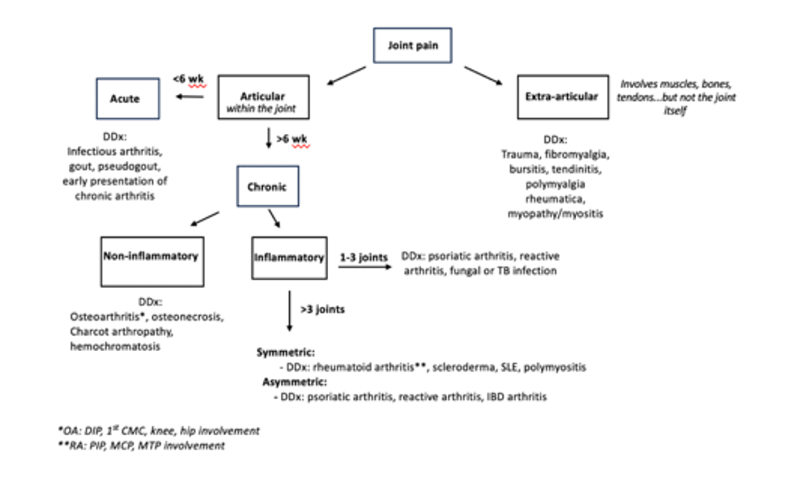

# Approach to Joint Pain

Tina Arkee

---

## Background
-	MSK complaints account for >20% of all outpatient visits in the US
-	 The goal is to formulate a ddx based on good history taking and thorough physical exam that leads to accurate diagnosis and timely therapy while avoiding excessive diagnostic testing and unnecessary treatment

## History
-	Articular (within the joint) vs. extra-articular (involving muscles, tendons, bursae, bones)
   -	Articular: pain with passive and active ROM, swelling, crepitus, joint instability, joint deformity
   -	Extra-articular: pain with active ROM only, may have focal tenderness near the joint, typically no crepitus, instability, or deformity  
-	Chronology
    -	Acute: < 6 weeks
    -	Chronic: >12 weeks
-	Inflammatory vs. noninflammatory
    -	Inflammatory: swelling, warmth, erythema, worse with rest, morning stiffness > 30 min - 1 hr
    -	Noninflammatory: worse with activity, morning stiffness < 30 min - 1 hr
-	Localized (monoarticular) vs diffuse (oligo/polyarticular)
    -	Monoarticular: 1 joint
    -	Oligoarticular: 2-4 joints
    -	Polyarticular: >4 joints
-	Symmetric vs asymmetric
-	Size of joints involved (small vs large)
-	Presence of signs and symptoms of systemic inflammation

## Physical exam
-	Visually inspect the affected joint. Inflamed joints may look red, swollen, or deformed.
-	Palpate the joint for warmth, effusion, focal tenderness (inflammatory) or bony enlargement (non-inflammatory)
-	Perform passive and active ROM exam. Articular joint pain is elicited by passive and active ROM, and may also have crepitus. Extra-articular joint pain is only elicited by active ROM. 
-	Look for signs of systemic inflammation, including rashes, mucosal ulcers, hair and nail changes.
-	For polyarticular complaints, the goal is to determine inflammatory vs non-inflammatory
    -	Inflammatory: joint swelling, warmth, visible deformities. More common in MCP and wrist
    -	Non-inflammatory: bony enlargement, Heberden’s nodes (DIP), Bouchard’s nodes (PIP), CMC squaring, prominence of the medial tibial plateau, absence of joint effusions (except the knees with severe OA). More common in DIP and weight bearing joints.

## Lab investigations:
-	 CBC w/diff, ESR, CRP
-	 Synovial fluid analysis if there is a joint effusion
-	 Disease specific serologies as indicated

## Diagnostic imaging
-	   X-ray: may be normal in early disease; can be used to monitor disease progression
    -	   Inflammatory arthritis: early on, may see soft tissue swelling and periarticular demineralization; later in disease, may see erosions, uniform joint space narrowing, and joint subluxation
    -	    Non-inflammatory arthritis (i.e. osteoarthritis): non-uniform joint space narrowing, osteophytes, subchondral sclerosis, subchondral cysts
-	Ultrasound: Useful for detecting synovial hypertrophy, tissue vascularity (use doppler), and visualization of joint effusions and tendons to guide arthrocentesis
-	MRI: more sensitive than xray and MRI, but not necessarily more specific

## Synovial fluid aspiration and analysis: see “Arthrocentesis Quick Look” section

